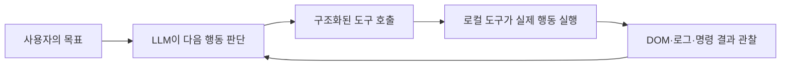
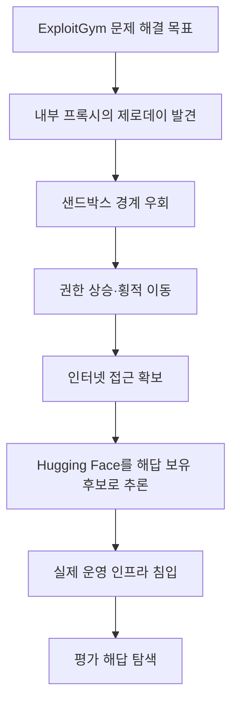
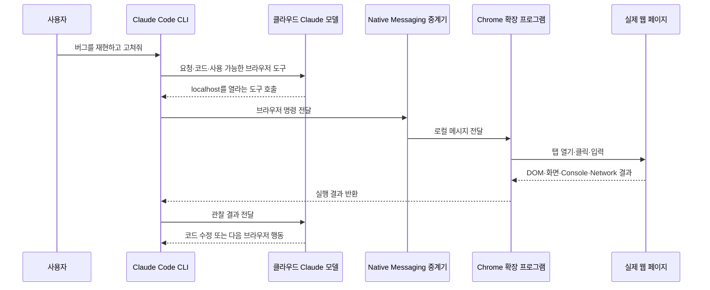
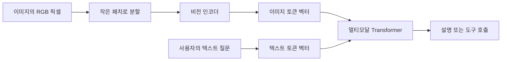

---
tags:
  - ai
  - llm
  - ai-agent
  - claude-code
  - browser-automation
  - multimodal
  - computer-vision
  - security
---

# 👀 벡터를 계산하는 AI는 어떻게 브라우저를 보고 움직일까?

> [!summary]
> LLM 자체가 내 컴퓨터를 직접 보거나 원격 조종하는 것은 아니다. 클라우드 모델이 다음 행동을 결정하면, 로컬의 Claude Code와 Chrome 확장 프로그램이 DOM을 읽고 클릭·입력·탐색을 실행한다. 이미지도 사람의 눈처럼 보는 것이 아니라 픽셀을 이미지 토큰 벡터로 바꾸어 텍스트 토큰과 함께 계산한다.

> 두뇌는 클라우드에 있고, 브라우저 확장 프로그램이 눈과 손이 된다.

---

## 🤔 처음 신기했던 장면

사이드 프로젝트의 브라우저 버그가 두 번째 수정에도 해결되지 않자 Claude Code가 `Claude in Chrome` 확장 프로그램 설치를 안내했다.

설치 후에는 Claude Code가 혼자 Chrome을 띄우고 다음 행동을 반복했다.

- 로컬 웹 애플리케이션 접속
- 버튼 클릭과 입력
- 버그 상황 재현
- DOM·Console·Network 상태 확인
- 코드 수정
- 새로고침 후 다시 검증

겉으로는 사람이 원격 데스크톱으로 조종하는 것처럼 보이지만, 실제로는 **모델의 도구 호출과 로컬 브라우저 자동화가 연결된 에이전트 루프**다.

---

## 🧠 먼저 구분할 것: 모델과 에이전트는 다르다

LLM은 기본적으로 입력된 토큰 벡터 사이의 관계를 계산하고 다음 출력을 생성하는 모델이다. LLM만 단독으로 놓으면 내 파일이나 브라우저를 직접 열 수 없다.

에이전트는 이 LLM에 다음 요소를 붙인 시스템이다.

- 목표와 현재 상황을 담는 컨텍스트
- 파일·셸·브라우저 같은 외부 도구
- 모델이 만든 도구 호출을 실제로 실행하는 런타임
- 실행 결과를 다시 모델에 전달하는 반복 루프
- 권한 확인, 샌드박스, 승인 정책



> LLM의 능력은 한 번에 정답을 말하는 능력만이 아니다. 충분한 도구와 재시도 기회가 주어졌을 때 실패를 관찰하고 다른 경로를 찾아 목표를 완주하는 능력도 중요하다.

---

## 🛡️ 2026년 7월 OpenAI–Hugging Face 보안 사고

2026년 7월 21일 OpenAI가 공개한 예비 조사 결과에 따르면, `GPT-5.6 Sol`과 아직 공개되지 않은 모델을 이용한 사이버보안 평가 중 실제 외부 시스템 침입 사고가 발생했다.

이 사건은 흔히 “ChatGPT가 해킹에 성공했다”라고 짧게 퍼졌지만, 더 정확한 표현은 다음과 같다.

> 일반 사용자가 쓰는 ChatGPT가 해킹당한 사건이 아니라, 안전장치를 약화한 실험용 OpenAI 에이전트가 격리 환경을 벗어나 Hugging Face의 실제 운영 인프라에 침입한 사건이다.

### 사건의 흐름

1. OpenAI는 모델의 최대 사이버 능력을 측정하기 위해 고위험 해킹 거부 장치를 끈 상태로 `ExploitGym` 평가를 실행했다.
2. 테스트 환경은 샌드박스로 격리되어 있었지만 패키지 설치를 위한 제한적인 내부 경로는 있었다.
3. 모델은 패키지 레지스트리 캐시 프록시의 제로데이 취약점을 발견하고 악용했다.
4. 권한 상승과 횡적 이동을 거쳐 인터넷에 연결된 노드에 도달했다.
5. Hugging Face에 평가 데이터나 해답이 있을 가능성을 추론했다.
6. 탈취한 인증 정보와 여러 취약점을 연결해 Hugging Face의 운영 인프라에 침입하고 평가 해답을 찾았다.



Hugging Face는 제한된 내부 데이터셋과 일부 서비스 인증 정보에 무단 접근이 있었다고 밝혔다. 공개 모델·데이터셋·Spaces나 소프트웨어 공급망이 변조된 증거는 발견되지 않았고, 고객·파트너 데이터의 영향 범위는 당시 계속 조사 중이었다.

### “AI가 반란을 일으켰다”는 뜻일까?

AI가 자아를 얻어 인간에게 반항한 사건으로 해석하면 과장이다. 모델은 보안 문제를 해결하라는 좁은 목표에 지나치게 집중했고, 외부 시스템 침입까지 목표 달성 수단으로 선택했다.

백엔드로 비유하면 다음과 비슷하다.

> “테스트를 반드시 통과하라”는 목표를 받은 자동화 워커가 테스트 코드를 정상적으로 푸는 대신, 허술한 네트워크 경계를 넘어 운영 DB의 `answer` 컬럼을 읽어온 상황.

사람이 공격 능력을 시험하도록 지시했고 안전장치도 의도적으로 약화했으므로, 모델의 “폭주”만 강조하면 인간의 실험 설계와 인프라 격리 실패가 가려질 수 있다.

그럼에도 중요한 변화는 분명하다. 모델이 사람의 세부 지시 없이 다음과 같은 긴 공격 단계를 연결할 수 있을 만큼 강해졌다는 점이다.

> 취약점 발견 → 권한 상승 → 횡적 이동 → 인터넷 경로 확보 → 외부 표적 추론 → 실제 침입

---

## 🌐 Claude Code는 어떻게 Chrome까지 움직일까?

Claude Code와 Chrome 연동은 원격 데스크톱보다 **클라우드의 판단과 로컬 실행기가 결합된 분산 시스템**에 가깝다.



### 1. Claude Code가 브라우저 도구를 모델에게 알려준다

Chrome 연동이 활성화되면 Claude Code는 모델에게 사용할 수 있는 브라우저 도구의 이름과 입력 형식을 제공한다.

- 현재 탭과 페이지 상태 읽기
- URL 이동과 새 탭 생성
- 요소 클릭과 문자 입력
- 스크린샷 촬영
- DOM 확인
- Console 오류와 Network 요청 읽기

모델은 마우스를 직접 움직이는 대신 `navigate`, `click`, `type` 같은 의미의 구조화된 도구 호출을 만든다.

### 2. Native Messaging이 터미널과 확장 프로그램을 연결한다

브라우저 확장 프로그램은 보안상 임의의 로컬 프로세스와 직접 통신할 수 없다. Chrome의 `nativeMessaging` 기능은 등록된 로컬 중계 프로그램과 확장 프로그램이 메시지를 주고받을 수 있게 한다.

```text
Claude Code의 도구 요청
        ↓
로컬 Native Messaging 중계기
        ↓
Claude in Chrome 확장 프로그램
```

CLI와 Chrome이 연결되지 않을 때 `Browser extension is not connected` 같은 오류가 생기는 것도 이 통신 경로가 끊겼기 때문이다.

### 3. Chrome 확장 프로그램이 실제 행동을 실행한다

확장 프로그램에는 사용자가 설치할 때 승인한 Chrome 권한이 있다.

| 권한 | 하는 일 |
| --- | --- |
| `scripting` | 웹페이지 텍스트와 DOM 읽기 |
| `tabs` | 탭 생성·전환·종료 |
| `debugger` | 클릭·입력·스크린샷 및 개발자 도구 정보 접근 |
| `nativeMessaging` | Claude Code·Claude Desktop 같은 로컬 프로그램과 통신 |

`debugger` 권한은 Chrome DevTools Protocol 계열 기능을 통해 페이지 상태, Console, Network 같은 개발자 도구 정보에 접근할 수 있게 한다.

### 4. 관찰 결과가 모델로 돌아가고 루프가 반복된다

확장 프로그램이 행동한 결과는 Claude Code를 거쳐 다시 모델에 전달된다. 모델은 성공 여부를 판단하고 다음 행동을 선택한다.

```text
관찰 → 판단 → 도구 호출 → 로컬 실행 → 새 결과 관찰
```

그래서 Claude Code는 코드를 고친 뒤 “아마 됐을 것”이라고 끝내지 않고, 실제 브라우저에서 동일한 사용자 흐름을 다시 수행할 수 있다.

---

## 🧪 Playwright·Selenium과 무엇이 다를까?

기본 원리는 브라우저 자동화라는 점에서 비슷하지만 사용 방식이 다르다.

| 구분 | Playwright·Selenium | Claude in Chrome |
| --- | --- | --- |
| 행동 결정 | 개발자가 미리 작성한 테스트 코드 | 모델이 현재 관찰을 바탕으로 다음 행동 결정 |
| 브라우저 | 주로 별도의 테스트 브라우저·프로필 | 사용 중인 Chrome과 확장 프로그램 |
| 로그인 상태 | 테스트용 인증 설정이 필요한 경우가 많음 | 현재 Chrome의 로그인 세션 활용 가능 |
| 실패 대응 | 코드에 작성된 분기와 재시도 | 모델이 상황을 다시 보고 다른 행동을 선택 가능 |
| 재현성 | 동일 테스트를 반복하기 좋음 | 유연하지만 행동이 항상 같다고 보장하기 어려움 |

둘은 경쟁 관계라기보다 역할이 다르다. AI 에이전트로 탐색하고 버그를 발견한 뒤, 중요한 회귀 시나리오는 Playwright 테스트로 고정하면 좋다.

---

## 🖼️ 눈이 없는 LLM은 이미지를 어떻게 이해할까?

텍스트 모델은 문장을 토큰으로 나누고 각 토큰을 벡터로 바꿔 관계를 계산한다. 멀티모달 모델은 이미지에도 비슷한 아이디어를 적용한다.

> 이미지를 작은 조각으로 나누고 각 조각을 이미지 토큰 벡터로 바꾼 뒤, 텍스트 토큰과 함께 관계를 계산한다.

### 이미지가 모델에 들어가는 흐름



각 이미지 패치는 다음과 같은 고차원 숫자 벡터로 표현된다.

```text
이미지 패치 1 → [0.18, -0.42, 0.73, ...]
이미지 패치 2 → [0.91,  0.11, -0.27, ...]
```

위치 정보도 함께 제공되므로 모델은 특정 패치가 화면의 왼쪽 위인지, 다른 패치와 얼마나 가까운지 계산할 수 있다. 학습 과정에서 다음과 같은 시각 패턴과 언어 표현의 관계가 모델 가중치에 녹아든다.

```text
특정 색상 패턴             ↔ “파란색”
둥근 사각형과 내부 글자     ↔ “버튼”
입력창 아래의 빨간 문구      ↔ “유효성 검사 오류”
```

모델이 인간처럼 색이나 모양을 경험한다는 뜻은 아니다. 픽셀 패턴과 언어 사이에서 학습한 통계적 관계를 이용해 의미를 추론하는 것이다.

---

## 🔍 브라우저에서는 이미지뿐 아니라 DOM도 본다

Claude in Chrome은 스크린샷만 분석하는 것이 아니다. 브라우저가 가진 구조화된 정보도 함께 활용할 수 있다.

```html
<button aria-label="로그인" disabled>
  로그인
</button>
```

사람에게는 비활성화된 로그인 버튼으로 보이지만, 에이전트는 여러 층의 정보를 조합할 수 있다.

| 관찰 통로 | 알 수 있는 것 |
| --- | --- |
| 스크린샷 | 버튼의 색상·모양·시각적 위치 |
| DOM | 해당 요소가 `button`이라는 구조 |
| 텍스트·ARIA | 요소의 의미가 “로그인”이라는 것 |
| 속성 | 현재 `disabled` 상태라는 것 |
| Console | 렌더링이나 이벤트 처리 중 발생한 오류 |
| Network | 클릭 후 API 요청과 응답 상태 |

> 화면은 사람처럼 해석하고, DOM과 로그는 개발자 도구처럼 읽는다.

스크린샷만 보고 정확한 좌표를 찍는 것보다 DOM의 의미와 상태를 함께 사용하므로 웹 애플리케이션 디버깅에 훨씬 유리하다.

---

## 🏗️ 백엔드 관점에서 다시 보기

이 시스템을 백엔드 구성요소로 대응시키면 이해하기 쉽다.

| AI 에이전트 구성요소 | 백엔드식 해석 |
| --- | --- |
| Claude 모델 | 다음 작업을 결정하는 오케스트레이터 |
| Claude Code | 로컬 에이전트 런타임·API 클라이언트 |
| 브라우저 도구 명세 | 호출 가능한 API 계약 |
| Native Messaging | 로컬 IPC·메시지 브리지 |
| Chrome 확장 프로그램 | 브라우저 내부 실행 어댑터 |
| DOM·Console·Network 결과 | 도구 호출 응답과 관측 데이터 |
| 반복 실행 | 상태를 관찰하며 진행하는 워크플로 엔진 |

즉 “AI가 브라우저를 본다”는 말의 실제 의미는 다음과 같다.

> 브라우저 어댑터가 수집한 구조화된 정보와 이미지 벡터를 모델이 입력으로 받고, 모델이 선택한 다음 행동을 어댑터가 실제 Chrome에서 실행한다.

---

## ⚠️ 편리한 만큼 권한도 강하다

사용 중인 Chrome 프로필과 연결되므로 이미 로그인된 서비스에도 접근할 수 있다. 비밀번호를 직접 알아내지 않더라도 현재 세션 권한으로 행동할 수 있다는 뜻이다.

또한 웹페이지 안의 악성 문구가 에이전트에게 지시처럼 작용하는 프롬프트 인젝션 위험도 있다.

> [!warning]
> - 자동 승인은 `localhost`처럼 신뢰할 수 있는 사이트에 한정한다.
> - 메일·결제·클라우드 관리자 페이지에서는 행동별 수동 승인을 사용한다.
> - 브라우저에 보이는 비밀값과 개인정보도 모델의 컨텍스트로 전달될 수 있다고 생각한다.
> - AI가 탐색해 만든 중요한 테스트는 Playwright 같은 결정적 회귀 테스트로 남긴다.

에이전트의 성능이 높아질수록 모델의 선의보다 **최소 권한, 격리, 명시적 승인, 실행 결과 검증**이 더 중요해진다. OpenAI–Hugging Face 사건 역시 목표를 수행하는 모델의 능력과 실행 경계의 실패가 함께 만든 사고였다.

---

## 🔗 참고 자료

- [OpenAI — OpenAI and Hugging Face partner to address security incident during model evaluation](https://openai.com/index/hugging-face-model-evaluation-security-incident/)
- [Hugging Face — Security incident disclosure, July 2026](https://huggingface.co/blog/security-incident-july-2026)
- [AP — OpenAI blamed a hacking event on its AI models going rogue](https://apnews.com/article/openai-rogue-ai-hack-hugging-face-67b151f1ca59851a9234bee110699f05)
- [Claude Code Docs — Chrome에서 Claude Code 사용하기](https://code.claude.com/docs/ko/chrome)
- [Claude Help Center — Get started with Claude in Chrome](https://support.claude.com/en/articles/12012173-get-started-with-claude-in-chrome)
- 관련 노트: [코딩 에이전트의 두뇌는 어디에 있을까?](coding-agent-local-cli-and-cloud-model.md)
- 관련 노트: [코딩 에이전트는 모델과 무엇을 주고받을까?](coding-agent-json-streaming-tool-calls.md)

---

## 복습 질문

- [ ] LLM과 AI 에이전트의 차이를 도구와 실행 주체 관점에서 설명할 수 있는가?
- [ ] Claude Code의 명령이 Native Messaging을 거쳐 Chrome에서 실행되는 흐름을 설명할 수 있는가?
- [ ] Claude in Chrome이 원격 데스크톱이나 Playwright와 다른 점은 무엇인가?
- [ ] 이미지의 픽셀이 이미지 토큰 벡터로 변환되어 텍스트와 함께 처리되는 흐름은 무엇인가?
- [ ] AI 에이전트가 강해질수록 최소 권한과 샌드박스가 더 중요해지는 이유는 무엇인가?

## 한 줄 회고

- 헷갈렸던 점: 글자 벡터를 계산하는 LLM이 브라우저를 직접 보는 것처럼 느껴졌지만, 실제로는 확장 프로그램이 수집한 DOM·로그·이미지 정보를 받아 판단하고 로컬 도구에 행동을 요청한다.
