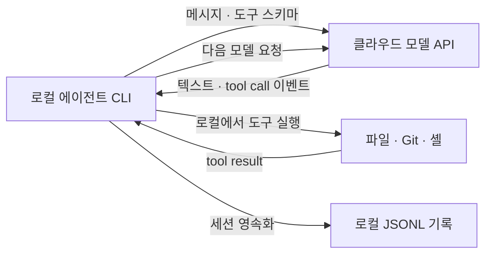
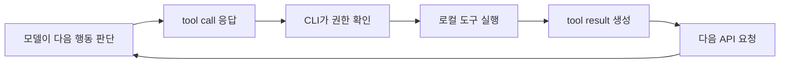
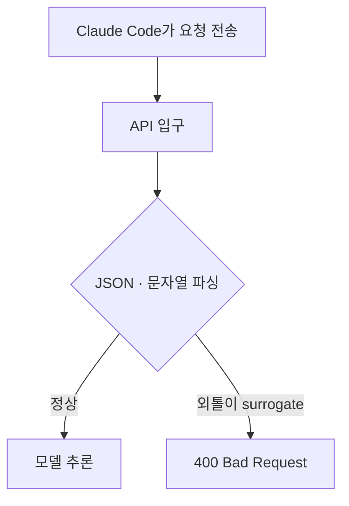

---
tags:
  - ai
  - coding-agent
  - claude-code
  - codex
  - json
  - jsonl
  - streaming
  - tool-use
  - unicode
  - surrogate
---

# 🔄 코딩 에이전트는 모델과 무엇을 주고받을까?

> [!summary]
> 코딩 에이전트는 모델에게서 문장만 받는 것이 아니라 **텍스트, 도구 호출과 인자를 담은 구조화된 메시지**를 받는다. 이 메시지는 주로 JSON과 스트리밍 이벤트로 전달되고, 로컬 세션은 JSONL로 저장될 수 있다.

---

## 🤔 처음 헷갈렸던 점

Codex와 Claude Code의 모델은 클라우드에서 추론하고 로컬 CLI가 파일과 명령을 다룬다. 그렇다면 클라우드 모델은 로컬 CLI에 “파일을 읽어라” 같은 행동을 어떤 형식으로 전달하는지 궁금했다.

레포의 surrogate 버그에서는 깨진 문자열 하나 때문에 API가 `400`을 반환하고 Claude Code 세션 전체가 먹통이 됐다. 이 사건을 이해하려면 다음 형식을 구분해야 한다.

1. API 요청과 응답을 표현하는 JSON
2. 응답을 조금씩 전달하는 스트리밍 이벤트
3. 도구 이름과 인자를 표현하는 tool call
4. 로컬 세션을 영속화하는 JSONL

---

## 🧩 전체 구조



각 기술의 역할은 다음과 같다.

| 구성 요소 | 역할 |
| --- | --- |
| LLM | 다음 텍스트와 행동을 판단 |
| JSON | 메시지와 도구 호출을 프로그램이 이해할 구조로 표현 |
| SSE·WebSocket 등의 스트리밍 | 완성된 응답을 기다리지 않고 이벤트를 조금씩 전달 |
| 에이전트 CLI | 도구 요청을 해석하고 로컬에서 실행 |
| JSONL | 대화, 도구 호출과 결과를 한 줄씩 로컬에 저장 |
| 샌드박스 | CLI가 실제 행동을 실행할 때 접근 범위를 제한 |

---

## 📤 에이전트가 모델에 보내는 JSON

Claude Messages API를 단순화하면 요청은 다음과 비슷하다.

```json
{
  "model": "claude-opus-...",
  "messages": [
    {
      "role": "user",
      "content": "로그인 버그를 찾아줘"
    }
  ],
  "tools": [
    {
      "name": "Read",
      "description": "파일을 읽는다",
      "input_schema": {
        "type": "object",
        "properties": {
          "file_path": {
            "type": "string"
          }
        },
        "required": ["file_path"]
      }
    }
  ]
}
```

CLI는 사용자 메시지만 보내는 것이 아니라 모델이 사용할 수 있는 **도구의 이름, 설명과 입력 스키마**도 전달한다.

```text
Read(file_path: string)
Edit(file_path: string, old_string: string, new_string: string)
Bash(command: string)
```

모델은 도구의 실제 구현을 알 필요가 없다. 어떤 이름의 도구가 있고 어떤 JSON 인자를 줘야 하는지만 알면 된다.

공식 문서: [Anthropic — Create a Message](https://platform.claude.com/docs/en/api/messages/create)

---

## 📥 모델은 문장뿐 아니라 tool call을 응답한다

모델이 파일을 읽고 싶다고 판단했을 때 사람에게 설명만 하는 것으로 끝나지 않는다.

```text
LoginService.java를 읽어야겠다.
```

대신 응답에 구조화된 `tool_use` content block을 담을 수 있다.

```json
{
  "role": "assistant",
  "content": [
    {
      "type": "tool_use",
      "id": "toolu_123",
      "name": "Read",
      "input": {
        "file_path": "src/auth/LoginService.java"
      }
    }
  ],
  "stop_reason": "tool_use"
}
```

로컬 Claude Code는 다음 값을 꺼낸다.

```text
도구 이름: Read
도구 호출 ID: toolu_123
인자: src/auth/LoginService.java
```

그다음 실제 파일 읽기는 모델 서버가 아니라 로컬 CLI가 수행한다.

> 모델은 “무엇을 실행할지” 선택하고, 로컬 에이전트는 “실제로 실행”한다.

공식 문서: [Anthropic — How tool use works](https://platform.claude.com/docs/en/agents-and-tools/tool-use/how-tool-use-works)

---

## 📬 도구 실행 결과도 구조화해서 돌려준다

CLI가 파일을 읽었다면 결과를 다시 모델에게 보낸다.

```json
{
  "role": "user",
  "content": [
    {
      "type": "tool_result",
      "tool_use_id": "toolu_123",
      "content": "public class LoginService { ... }"
    }
  ]
}
```

여기서 `role: "user"`는 모기가 직접 입력했다는 뜻이라기보다 모델 바깥에서 들어온 다음 입력이라는 API 구조다. `tool_use_id`를 사용하면 모델이 요청한 도구 호출과 실행 결과를 연결할 수 있다.

```text
모델의 tool_use: toolu_123
          ↕ 같은 ID
CLI의 tool_result: toolu_123
```

---

## 🔁 이것이 에이전트 루프다



에이전트는 특별한 종류의 단일 모델이라기보다, 다음 반복을 운영하는 전체 시스템에 가깝다.

> 판단 → 도구 요청 → 로컬 실행 → 결과 전달 → 다음 판단

Codex도 큰 개념은 같다. 도구 이름과 이벤트 스키마는 Claude와 다를 수 있지만, 모델의 구조화된 도구 호출을 로컬 실행기가 처리하고 결과를 다음 모델 입력으로 돌려준다는 에이전트 루프는 공통적이다.

관련 노트: [코딩 에이전트의 두뇌는 어디에 있을까?](coding-agent-local-cli-and-cloud-model.md)

---

## 📡 완성된 JSON 한 덩어리만 받는 것은 아니다

터미널에서 답변이 한 글자씩 나타나는 이유는 응답을 스트리밍하기 때문이다. Claude API는 SSE(Server-Sent Events)를 사용해 응답을 여러 이벤트로 나눠 전달할 수 있다.

```text
event: content_block_delta
data: {"type":"content_block_delta","index":0,
       "delta":{"type":"text_delta","text":"로그인"}}
```

다음 이벤트:

```text
event: content_block_delta
data: {"type":"content_block_delta","index":0,
       "delta":{"type":"text_delta","text":" 버그를"}}
```

CLI 또는 SDK는 이 조각들을 합쳐 화면에 연속된 문장으로 보여준다.

```text
"로그인" + " 버그를" + " 찾았습니다"
→ "로그인 버그를 찾았습니다"
```

SSE 자체는 이벤트 단위의 전달 규칙이고, 각 이벤트의 `data`에는 JSON 구조가 들어간다.

공식 문서: [Anthropic — Streaming messages](https://platform.claude.com/docs/en/build-with-claude/streaming)

---

## 🧱 도구 인자는 부분 JSON으로 스트리밍될 수 있다

도구 호출의 `input`도 한 번에 완성된 객체로 오지 않을 수 있다.

첫 번째 이벤트:

```json
{
  "type": "input_json_delta",
  "partial_json": "{\"file_path\":\"src/auth/"
}
```

다음 이벤트:

```json
{
  "type": "input_json_delta",
  "partial_json": "LoginService.java\"}"
}
```

조각을 모두 합친 뒤 JSON으로 파싱하면 최종 인자가 된다.

```json
{
  "file_path": "src/auth/LoginService.java"
}
```

이 단계에서는 아직 완성되지 않은 JSON 문자열을 다루기 때문에 중간 조각 하나만 보고 일반 JSON처럼 파싱하면 실패할 수 있다. SDK가 스트림을 조립하고 content block의 종료를 확인한 뒤 최종 객체로 만드는 이유다.

> 네트워크에서는 부분 JSON 문자열로 올 수 있지만, 최종 `tool_use.input`은 객체가 된다.

---

## 🗃️ API JSON과 로컬 JSONL은 다르다

Claude Code는 세션을 다음 경로에 JSONL 형식으로 저장한다.

```text
~/.claude/projects/<project>/<session-id>.jsonl
```

일반 JSON은 하나의 배열로 여러 기록을 묶을 수 있다.

```json
[
  {"role": "user", "content": "버그 찾아줘"},
  {"role": "assistant", "content": "파일을 읽겠습니다"}
]
```

JSONL은 한 줄마다 독립적인 JSON 객체를 둔다.

```jsonl
{"role":"user","content":"버그 찾아줘"}
{"role":"assistant","content":"파일을 읽겠습니다"}
{"type":"tool_use","name":"Read","input":{"file_path":"LoginService.java"}}
```

로그처럼 새로운 기록을 마지막에 한 줄씩 추가하기 쉽고, 대용량 기록을 앞에서부터 순차적으로 읽기도 편하다.

Claude Code는 메시지, 도구 호출, 도구 결과와 메타데이터를 세션 JSONL에 저장한다. 이 파일 덕분에 세션을 resume하거나 fork할 수 있다.

공식 문서: [Anthropic — Manage sessions](https://code.claude.com/docs/en/sessions)

> [!warning]
> Claude Code의 로컬 transcript는 평문이다. 파일 내용이나 명령 출력에 비밀값이 포함되어 도구 결과로 기록되면 JSONL에도 남을 수 있다.

---

## 💥 surrogate 버그는 어떻게 세션 전체를 죽였나?

레포에 기록된 사건에서는 `AskUserQuestion` 도구 호출의 선택지 설명에 짝이 없는 high surrogate가 들어갔다.

정상적인 도구 호출:

```json
{
  "type": "tool_use",
  "name": "AskUserQuestion",
  "input": {
    "description": "검사 로직을 수정합니다"
  }
}
```

문제가 된 형태:

```json
{
  "type": "tool_use",
  "name": "AskUserQuestion",
  "input": {
    "description": "검사 로직을 \uD83A 수정합니다"
  }
}
```

UTF-16의 surrogate는 high와 low 두 조각이 짝을 이뤄야 한다.

```json
"\uD83D\uDE00"
```

그러나 문제의 문자열은 high surrogate만 있었다.

```json
"\uD83A"
```

이 값이 도구 호출 기록에 들어간 뒤 Claude Code의 로컬 JSONL에도 저장됐다.

관련 사건 노트: [외톨이 surrogate가 세션을 brick 시킨 버그](claude-code-prohan-surrogate-brick-bug.md)

---

## 🔬 파일 바이트는 정상인데 JSON을 읽으면 깨질 수 있다

JSONL 파일에는 깨진 UTF-8 바이트가 아니라 다음 여섯 ASCII 문자가 기록될 수 있다.

```text
\ u D 8 3 A
```

따라서 raw UTF-8 바이트만 검사하면 파일이 정상처럼 보인다.

```text
디스크의 바이트
→ 백슬래시 · u · D · 8 · 3 · A
→ 모두 정상 ASCII
```

하지만 JSON 파서가 escape를 문자열로 해석하는 순간 문제가 드러난다.

```text
JSON escape \uD83A 해석
        ↓
high surrogate 코드 유닛
        ↓
뒤에 low surrogate 없음
        ↓
엄격한 파서가 문자열 거부
```

그래서 사건을 조사할 때 두 경로를 모두 확인해야 했다.

| 검사 | 찾는 대상 |
| --- | --- |
| raw UTF-8 바이트 검사 | 파일에 잘못된 surrogate 바이트가 직접 들어갔는가 |
| JSON escape 검사 | `\uD800`~`\uDBFF` 형태의 외톨이 high surrogate가 있는가 |

---

## ♻️ 왜 다음 turn도 계속 실패했을까?

다음 API 요청을 보낼 때 에이전트는 현재 대화 컨텍스트를 구성한다. 이때 문제가 있는 과거 도구 호출이 계속 포함되면 새 요청도 오염된다.

```text
1번 turn  정상
2번 turn  정상
3번 turn  외톨이 \uD83A 포함
4번 turn  사용자가 새 메시지 입력
```

다음 요청을 단순화하면:

```json
{
  "messages": [
    {"turn": 1, "content": "정상"},
    {"turn": 2, "content": "정상"},
    {"turn": 3, "content": "깨진 \uD83A 기록"},
    {"turn": 4, "content": "뭐야?"}
  ]
}
```

API 서버는 모델 추론 전에 요청 본문을 역직렬화하고 문자열을 검증해야 한다.



이 사건에서는 파싱 단계에서 다음 에러가 발생했다.

```text
API Error: 400
The request body is not valid JSON:
no low surrogate in string
```

따라서 새 사용자 메시지는 Claude 모델까지 도달하지 못했다.

---

## 🧑‍💻 백엔드 요청 역직렬화로 비유하면

Spring 서버가 다음 요청을 받았다고 생각해 보자.

```text
HTTP request body
        ↓
Jackson · HttpMessageConverter
        ↓
DTO 역직렬화
        ↓
Controller
        ↓
Service
```

request body의 JSON 문자열이 깨져 있으면 Controller에 진입하기도 전에 `400 Bad Request`가 발생할 수 있다.

Claude surrogate 사건도 비슷하다.

```text
Claude Code의 API 요청
        ↓
API JSON · 문자열 파서
        ↓ 여기서 실패
Claude 모델 추론
```

> Claude가 질문을 이해하지 못한 것이 아니라, **Claude를 호출하는 요청이 API 입구에서 파싱되지 못한 것**이다.

---

## 📍 왜 에러 위치가 매번 같았을까?

사용자가 다음처럼 현재 입력을 바꿔도:

```text
뭐야
wtf
?
```

오염된 과거 기록의 위치는 변하지 않았다.

```text
[과거 정상 기록][오염된 \uD83A][새로운 입력]
                ↑
          매번 거의 같은 위치
```

현재 입력은 요청 뒤쪽만 바꾸므로 오염된 문자열의 offset이 계속 동일하게 유지될 수 있다.

따라서 같은 `char 703862`에서 반복적으로 실패한 현상은 **새 입력이 아니라 누적된 과거 상태가 원인이라는 강한 증거**였다.

---

## 🧹 `/clear`가 왜 복구시켰을까?

`/clear`는 새 컨텍스트로 시작한다.

```text
기존 컨텍스트
[정상][정상][오염][새 입력]
              ↑ 파싱 실패

/clear 이후
[새 입력]
   ↑ 정상
```

이전 JSONL 파일이 반드시 삭제되는 것은 아니다. 과거 세션은 디스크에 남아 resume할 수도 있다. 다만 새 모델 요청의 컨텍스트에서 오염된 turn이 제외되므로 API 요청을 다시 정상적으로 만들 수 있다.

---

## ⚠️ “매번 JSONL 전체를 보낸다”는 표현은 정확할까?

Claude Messages API는 stateless한 대화 요청을 지원하므로 클라이언트가 필요한 이전 대화를 요청에 포함해야 한다. 하지만 Claude Code가 로컬 JSONL 파일의 모든 바이트를 매번 그대로 복사해 전송한다고 단정하면 안 된다.

실제 긴 세션에서는 다음 처리가 개입할 수 있다.

- 오래된 내용을 요약하는 compaction
- 큰 도구 결과를 별도 파일로 분리
- 현재 컨텍스트에서 제외되는 기록
- prompt caching

더 정확한 표현은 다음과 같다.

> Claude Code는 저장된 세션 상태를 바탕으로 현재 모델 컨텍스트에 필요한 메시지와 도구 기록을 구성한다.

surrogate 사건에서는 오염된 도구 호출이 이 컨텍스트 구성에 계속 포함되었기 때문에 요청이 반복해서 실패한 것으로 보는 것이 자연스럽다.

---

## 🕵️ 모델 버그일까, CLI 버그일까?

### 관찰된 사실

- 깨진 값이 assistant의 `tool_use` 내용에 있었다.
- 다음 API 요청을 보내기 전부터 로컬 JSONL에 저장되어 있었다.
- 이후 요청이 같은 surrogate 오류로 반복 실패했다.
- `/clear`로 과거 컨텍스트를 제외하자 복구됐다.

### 강하게 의심되는 흐름

- 모델 출력 또는 모델 출력을 구조화하는 단계에서 외톨이 surrogate가 생겼다.
- 응답 조립과 저장 경계에서 문자열 검증이 충분하지 않았다.
- 오염된 turn 하나를 격리하지 못해 세션 전체 장애로 증폭됐다.

### 증거만으로 단정하기 어려운 경계

- 모델 토큰 생성 자체
- 스트리밍 조각을 합치는 과정
- API 응답을 SDK 객체로 변환하는 과정
- Claude Code의 직렬화 과정

따라서 가장 엄밀한 결론은 다음과 같다.

> 모델 쪽에서 유래한 것으로 보이는 깨진 도구 문자열을 여러 경계가 검증 없이 통과시켰고, Claude Code가 이를 영속화하면서 반복 가능한 장애로 증폭시켰다.

---

## 🛡️ 시스템 설계에서 얻을 교훈

### 경계마다 검증하기

```text
모델 스트림 수신
→ 부분 JSON 조립
→ tool input 객체 생성
→ 로컬 JSONL 저장
→ 다음 API 요청 직렬화
```

각 경계에서 문자열과 구조를 검증하면 깨진 데이터가 다음 단계로 퍼지는 것을 막을 수 있다.

### 영속화 전에 검증하기

외부 입력을 그대로 저장하면 일시적인 잘못된 응답이 재실행 가능한 영구 장애가 될 수 있다.

```text
잘못된 turn 하나
→ JSONL에 저장
→ 매 요청마다 replay
→ 세션 전체 brick
```

### 한 레코드의 실패를 전체 장애로 만들지 않기

깨진 turn만 실패시키거나 격리할 수 있어야 한다.

```text
한 turn 실패   권장
세션 전체 실패  피해야 함
```

### 원본 관측 정보도 보존하기

무조건 잘못된 문자를 치환하면 서비스는 살아날 수 있지만 장애 원인을 찾을 텔레메트리가 사라질 수 있다. 복구용 정화와 원인 분석용 원본 보존을 함께 설계해야 한다.

---

## 💬 한 문장으로 설명하면

> 코딩 에이전트는 모델의 텍스트와 도구 호출을 JSON 기반 메시지와 스트리밍 이벤트로 받고, 로컬에서 도구를 실행한 결과를 다시 모델에 보내며, Claude Code는 이 과정을 JSONL 세션 기록으로 영속화한다.

---

## 복습 질문

- [ ] API JSON, 스트리밍 이벤트, tool call과 JSONL은 각각 어떤 역할을 하는가?
- [ ] 모델의 `tool_use`와 로컬 CLI의 `tool_result`는 어떻게 연결되는가?
- [ ] 도구 인자의 부분 JSON 스트림은 언제 완성된 객체로 파싱할 수 있는가?
- [ ] 외톨이 surrogate 하나가 다음 turn과 세션 전체를 계속 실패시킨 이유는 무엇인가?
- [ ] 이 장애를 Spring request body 역직렬화 실패와 어떻게 비교할 수 있는가?

## 한 줄 회고

- 헷갈렸던 점: 에이전트는 모델의 문장을 그대로 출력하는 프로그램이 아니라, **JSON 기반의 구조화된 도구 호출을 실행하고 결과를 재전송하며 그 상태를 JSONL로 영속화하는 반복 시스템**이었다.
