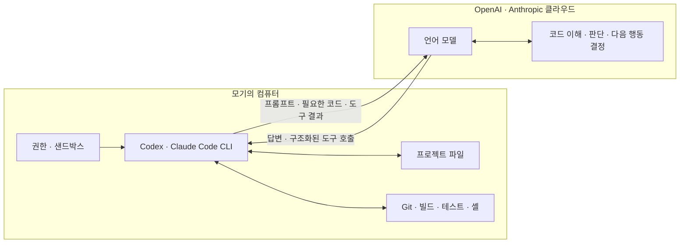
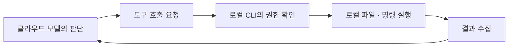

---
tags:
  - ai
  - coding-agent
  - codex
  - claude-code
  - cli
  - api
  - cloud
  - agent-loop
---

# 🧠 코딩 에이전트의 두뇌는 어디에 있을까?

> [!summary]
> 일반적인 Codex·Claude Code 로컬 CLI는 **클라우드 모델을 두뇌로 사용하면서, 로컬 CLI가 내 컴퓨터에서 파일을 읽고 명령을 실행하는 하이브리드 구조**다.

> 두뇌는 클라우드에 있고, 눈과 손 그리고 작업장은 내 컴퓨터에 있다.

---

## 🤔 처음 헷갈렸던 점

Codex와 Claude Code를 터미널에 직접 설치해서 사용하니 모델도 내 컴퓨터에서 실행되는 것처럼 보였다. 그런데 네트워크를 끊으면 작업이 멈추고, 클라우드 방식 또는 API를 사용한다는 설명도 들었다.

다음 세 가지가 서로 섞여 헷갈렸다.

- 로컬에 설치한 CLI의 정체는 무엇인가?
- 실제 GPT·Claude 모델은 어디서 실행되는가?
- 로컬 방식과 클라우드 실행 방식은 무엇이 다른가?

---

## 🏗️ 전체 구조

일반적인 로컬 CLI 사용에서는 모델 추론과 도구 실행이 서로 다른 장소에서 일어난다.



클라우드의 모델은 코드를 이해하고 다음 행동을 판단한다. 로컬 CLI는 그 판단을 받아 실제 파일을 읽고 수정하며 명령을 실행한다.

따라서 완전한 로컬 프로그램도 아니고, 모든 작업이 클라우드에서 실행되는 것도 아니다.

---

## 📦 로컬에 설치된 것은 무엇일까?

일반적인 Codex·Claude Code 설치 파일에는 다음과 같은 **에이전트 실행 프로그램**이 들어 있다.

- 터미널 사용자 인터페이스
- 로그인과 인증 정보 관리
- 클라우드 모델 서비스와 통신하는 클라이언트
- 대화 기록과 작업 상태 관리
- 파일 검색·읽기·수정 도구
- Bash 또는 셸 명령 실행 기능
- Git 연동
- MCP·스킬·플러그인 같은 확장 기능 연결
- 권한 요청과 샌드박스 처리
- 모델의 도구 요청을 실행하고 결과를 반환하는 에이전트 런타임

반면 일반적인 클라우드 모델 사용 방식에서는 다음과 같은 **모델 자체**가 내 컴퓨터에 설치되지 않는다.

```text
GPT 또는 Claude의 전체 모델 가중치
대규모 모델 추론에 필요한 GPU 서버
모델 제공사의 추론 시스템
```

즉 로컬에 설치한 프로그램은 GPT나 Claude 그 자체가 아니다.

> 로컬 CLI는 **클라우드 모델을 내 개발 환경과 연결하고, 모델의 판단을 실제 행동으로 바꿔주는 실행기**다.

---

## 🔁 에이전트 루프는 어떻게 동작할까?

모기가 다음과 같이 요청했다고 하자.

```text
로그인 버그를 찾아서 고쳐줘.
```

### 1. 로컬 CLI가 모델 요청을 준비한다

CLI는 작업에 필요한 정보를 모아 클라우드 모델에 전송한다.

- 사용자가 입력한 요청
- `AGENTS.md`, `CLAUDE.md` 같은 프로젝트 지침
- 모델이 사용할 수 있는 도구의 설명
- 현재 대화와 이전 도구 실행 결과
- 이미 읽은 파일 내용이나 검색 결과

이때 클라우드 모델이 내 SSD를 직접 탐색하는 것은 아니다. 로컬 CLI가 읽어서 컨텍스트에 넣은 정보만 모델이 볼 수 있다.

### 2. 클라우드 모델이 다음 행동을 정한다

모델은 바로 최종 답변을 만들 수도 있지만, 먼저 구조화된 도구 호출을 반환할 수 있다.

```text
src/auth/LoginService.java 파일을 읽어라.
```

### 3. 로컬 CLI가 실제 파일을 읽는다

CLI는 권한과 샌드박스 경계를 확인한 뒤 내 컴퓨터에서 파일을 읽는다.

```text
로컬 CLI
  ↓
LoginService.java 읽기
  ↓
파일 내용 획득
  ↓
필요한 결과를 클라우드 모델에 전달
```

### 4. 모델이 수정 방향을 판단한다

모델은 전달받은 코드를 보고 다음과 같은 도구 호출을 요청할 수 있다.

```text
LoginService.java의 인증 조건을 수정해라.
```

### 5. 로컬 CLI가 파일을 수정한다

현재 권한과 샌드박스에서 허용되는 작업이라면 CLI가 실제 로컬 파일을 변경한다. 경계 밖의 작업이면 실행을 차단하거나 사용자에게 승인을 요청한다.

### 6. 테스트도 로컬에서 실행한다

모델이 다음 명령 실행을 요청했다고 하자.

```text
./gradlew test를 실행해라.
```

실제 흐름은 다음과 같다.

```text
클라우드 모델
“테스트를 실행해.”
        ↓
로컬 CLI
./gradlew test
        ↓
모기의 JVM에서 테스트 실행
        ↓
stdout · stderr · 종료 코드 수집
        ↓
클라우드 모델에 결과 전달
```

모델은 결과를 보고 추가 수정이 필요한지 판단한다. 이 과정이 반복된다.



이런 **판단 → 도구 요청 → 로컬 실행 → 결과 전달 → 다음 판단**의 반복을 에이전트 루프라고 이해하면 된다.

관련 노트: [코딩 에이전트는 모델과 무엇을 주고받을까?](coding-agent-json-streaming-tool-calls.md)

---

## 🌐 API를 사용하는 걸까?

넓은 의미에서는 API를 사용한다. 로컬 CLI 프로그램이 네트워크를 통해 모델 서비스에 요청을 보내고 응답을 받기 때문이다.

다만 다음 두 문장은 서로 다르다.

```text
모델 서비스와 API 방식으로 통신한다.

내가 개발자용 API 키를 직접 사용한다.
```

API 통신을 하더라도 인증 수단이 개발자용 API 키가 아닐 수 있다.

### Codex 인증

Codex 로컬 작업은 다음 인증 방식을 지원한다.

- ChatGPT 계정 로그인: 구독 권한으로 사용
- OpenAI API 키 로그인: 사용량 기반 API 과금으로 사용

ChatGPT 계정으로 로그인했다면 API 키 대신 로그인 과정에서 발급된 인증 정보로 Codex 서비스에 접속한다. 따라서 API 키를 직접 입력하지 않았더라도 원격 모델 서비스와의 네트워크 통신은 일어난다.

공식 문서: [OpenAI — Codex Authentication](https://learn.chatgpt.com/docs/auth.md)

### Claude Code 인증

Claude Code도 여러 인증 방식을 지원한다.

- Claude Pro·Max·Team·Enterprise 계정의 OAuth 로그인
- Anthropic Console의 `ANTHROPIC_API_KEY`
- Amazon Bedrock
- Google Vertex AI
- Microsoft Foundry

Claude 구독 계정으로 `/login`했다면 OAuth 자격 증명을 사용하고, `ANTHROPIC_API_KEY`가 설정되어 있다면 API 키가 우선 사용될 수 있다.

공식 문서: [Anthropic — Claude Code Authentication](https://code.claude.com/docs/en/authentication)

> [!summary]
> API는 프로그램끼리 통신하는 방식이고, API 키와 OAuth는 그 요청을 누가 보냈는지 증명하는 서로 다른 인증 수단이다.

---

## 📡 네트워크가 끊기면 왜 멈출까?

모델의 추론이 클라우드에서 실행되기 때문이다.

```text
모델: 이 파일을 읽어 봐.
  ↓
CLI: 읽었어. 내용은 이거야.
  ↓
네트워크 단절
  ↓
결과를 모델에 전달할 수 없음
  ↓
다음 행동을 판단할 두뇌와 통신 불가
```

네트워크가 끊겨도 로컬에 이미 생긴 결과가 모두 사라지는 것은 아니다.

- 이미 수정된 파일은 로컬 디스크에 남는다.
- 이미 실행한 로컬 개발 서버는 계속 실행될 수 있다.
- 시작한 테스트나 빌드는 로컬 프로세스에서 끝까지 진행될 수 있다.
- CLI에 저장된 로컬 대화·세션 데이터도 그대로 남을 수 있다.

하지만 모델의 새로운 판단이 필요한 에이전트 루프는 진행할 수 없다. 실행 중인 명령이 끝나더라도 그 결과를 모델이 해석하고 다음 행동을 정하려면 다시 네트워크가 필요하다.

> 로컬의 손과 눈은 남아 있지만, 클라우드의 두뇌와 대화할 수 없어서 다음 일을 결정하지 못하는 상태다.

---

## 📤 내 코드 전체가 클라우드로 올라갈까?

일반적인 로컬 CLI 작업에서는 저장소를 통째로 원격 실행 환경에 복제하여 명령을 실행하는 것이 아니다. 파일 수정과 명령 실행은 내 컴퓨터에서 일어난다.

하지만 클라우드 모델이 코드를 이해하려면 모델 컨텍스트로 들어간 정보는 네트워크를 통해 전송되어야 한다.

예를 들면 다음 내용이 전송될 수 있다.

- 사용자의 프롬프트
- CLI가 읽은 파일 내용
- 코드 검색 결과
- 변경 diff
- 테스트와 빌드 출력
- 도구 호출과 실행 결과
- 대화 기록과 프로젝트 지침

```text
클라우드 모델이 내 SSD 전체를 직접 탐색    X

로컬 CLI가 필요한 파일과 결과를 읽음
→ 모델이 판단할 수 있도록 전송             O
```

Claude Code 공식 문서는 로컬 프로그램이 LLM과 상호작용하기 위해 프롬프트와 모델 출력 등의 데이터를 네트워크로 전송한다고 설명한다.

공식 문서: [Anthropic — Claude Code Data Usage](https://code.claude.com/docs/en/data-usage)

> [!warning]
> `.env`, SSH 키, 운영 데이터, 고객 개인정보처럼 모델 판단에 불필요한 민감 정보는 권한 규칙과 샌드박스로 접근을 막고 프롬프트에 직접 붙여넣지 않는다. 서버 측 저장·학습·보존 정책은 사용한 계정, 요금제와 조직 설정에 따라 다를 수 있다.

---

## 🏠 로컬 실행과 ☁️ 클라우드 실행

“모델이 클라우드에서 실행된다”와 “코드 작업도 클라우드에서 실행된다”는 서로 다른 말이다.

### 로컬 CLI 작업

```text
모델의 추론 → OpenAI · Anthropic 클라우드
파일과 명령 → 모기의 컴퓨터
```

모델은 원격에 있지만 Git, Java, Node.js, 테스트와 프로젝트 파일은 내 컴퓨터의 것을 사용한다. 이것을 로컬 실행 환경이라고 부를 수 있다.

Claude Code 공식 문서는 기본 Local 환경에서 코드가 사용자의 컴퓨터에서 실행된다고 설명한다.

공식 문서: [Anthropic — How Claude Code works](https://code.claude.com/docs/en/how-claude-code-works)

### 클라우드 작업

```text
모델의 추론 → 회사 클라우드
파일과 명령 → 회사가 관리하는 원격 VM · 컨테이너
```

Codex Cloud는 원격 컨테이너를 만들고 저장소의 선택한 브랜치나 커밋을 checkout한 뒤, 그 환경에서 코드를 수정하고 테스트한다.

공식 문서: [OpenAI — Codex Cloud environments](https://learn.chatgpt.com/docs/environments/cloud-environment.md)

Claude Code Cloud도 저장소를 Anthropic이 관리하는 VM에 준비하고 그곳에서 명령을 실행한다.

| 사용 방식 | 모델 추론 | 파일과 명령 실행 |
| --- | --- | --- |
| Codex 로컬 CLI | 클라우드 | 내 컴퓨터 |
| Claude Code 로컬 CLI | 클라우드 | 내 컴퓨터 |
| Codex Cloud | 클라우드 | OpenAI 관리 환경 |
| Claude Code Cloud | 클라우드 | Anthropic 관리 VM |

따라서 “클라우드 방식”이라는 표현을 들으면 **모델만 클라우드인지, 코드 실행 환경까지 클라우드인지**를 구분해야 한다.

---

## 🖥️ 로컬 모델을 사용할 수도 있을까?

Codex에는 Ollama 또는 LM Studio 같은 로컬 모델 공급자를 선택해 오픈소스 모델을 사용하는 별도 방식도 있다. 이 경우에는 모델 추론까지 로컬에서 처리할 수 있다.

하지만 기본적인 OpenAI 모델이나 Claude 모델 사용은 원격 모델 서비스에 연결하는 방식이다. 로컬 모델 실행은 모델 다운로드, 충분한 메모리·연산 자원, 별도 설정이 필요한 예외적인 구성으로 이해하면 된다.

```text
일반적인 Codex · Claude Code
→ 클라우드 모델 + 로컬 도구 실행

명시적인 로컬 모델 구성
→ 로컬 모델 + 로컬 도구 실행
```

---

## 🔐 샌드박스는 어디에 끼어들까?

샌드박스는 클라우드 모델과 로컬 CLI 사이의 통신 방식이 아니라, **로컬 CLI가 모델의 요청을 실제로 실행할 때 적용되는 안전 경계**다.

```text
클라우드 모델
“프로젝트 밖의 파일을 수정해.”
        ↓
로컬 CLI
        ↓
샌드박스와 승인 정책
        ↓
허용 · 사용자에게 질문 · 차단
```

모델이 위험한 도구 호출을 요청하더라도 로컬 실행기가 무조건 따르지 않고, 현재 권한과 사용자의 승인을 확인한다.

관련 노트: [샌드박스와 Codex 권한](sandbox-concept-and-codex-permissions.md)

---

## 🐧 WSL2에서 실행한다면

Claude Code나 Codex를 WSL2에 설치했을 때 로컬 작업장은 Windows가 아니라 WSL2의 Linux 환경이다.

```text
클라우드 모델
      ↕ 네트워크
WSL2 안의 로컬 CLI
      ↕
WSL2의 파일 · Bash · Git · Java · Node.js
```

그래서 Windows에 설치한 Node.js가 아니라 WSL2에 설치한 Node.js가 사용되고, 프로젝트 파일도 WSL2의 경로와 권한 체계를 따른다. 모델 두뇌가 클라우드에 있다는 점은 macOS나 Windows에서 사용할 때와 같다.

관련 노트: [WSL2는 가상 머신일까?](../operating-system/wsl2-managed-lightweight-vm.md)

---

## 💬 한 문장으로 설명하면

> Codex와 Claude Code의 로컬 CLI는 모델 자체가 아니라, 클라우드 모델과 API로 통신하면서 모델이 요청한 파일 작업과 명령을 내 컴퓨터에서 안전하게 실행하는 에이전트 런타임이다.

---

## 복습 질문

- [ ] 로컬 CLI와 클라우드 모델은 각각 어떤 역할을 담당하는가?
- [ ] 판단 → 도구 요청 → 로컬 실행 → 결과 전달이 반복되는 과정을 무엇이라고 하는가?
- [ ] API 통신을 하는 것과 개발자용 API 키로 인증하는 것은 왜 다른 말인가?
- [ ] 네트워크가 끊겼을 때 로컬 프로세스는 남아도 에이전트 루프가 멈추는 이유는 무엇인가?
- [ ] 로컬 CLI 작업과 Codex·Claude Code의 클라우드 작업은 코드가 실행되는 위치가 어떻게 다른가?

## 한 줄 회고

- 헷갈렸던 점: 터미널에 설치한 것은 GPT나 Claude 모델 자체가 아니라, **클라우드의 두뇌와 통신하며 내 로컬 개발 환경을 눈과 손처럼 사용하는 에이전트 실행기**였다.
