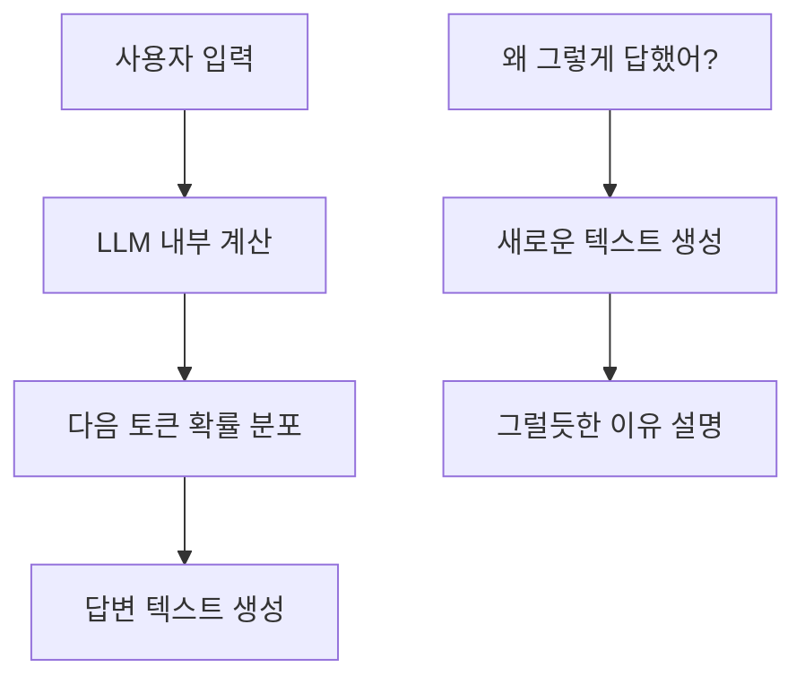

---
tags:
  - ai
  - llm
  - reasoning
  - interpretability
  - backend
---

# 왜 LLM은 자기 사고과정을 정확히 설명할 수 없는가

> [!summary]
> LLM이 답을 만드는 실제 내부 계산 과정과, 나중에 "왜 그렇게 답했는지" 설명하는 문장은 같은 것이 아니다.
>
> 실제 답 생성은 내부 행렬 연산이고, 이유 설명은 다시 생성된 텍스트다.

## 내가 물어본 질문

> [!question]
> 왜 LLM의 사고과정을 LLM이 설명해줄 수 없는 거임?

## 먼저 잡을 한 줄 정의

> [!info]
> LLM의 "이유 설명"은 내부 계산 로그를 읽어서 출력하는 것이 아니라, 질문을 받은 뒤 새로 생성한 설명문이다.

LLM은 답을 만들 때 수많은 파라미터와 레이어를 거쳐 다음 토큰의 확률 분포를 계산한다. 하지만 모델이 그 계산 과정을 자기 입장에서 직접 조회할 수 있는 통로가 있는 것은 아니다.

백엔드로 보면, 거대한 미들웨어 파이프라인을 요청이 통과해서 응답이 나갔는데 로그, 디버거, APM, 트레이싱이 하나도 없는 상태와 비슷하다. 함수는 결과값을 리턴할 수 있지만, 방금 어떤 내부 경로로 그 결과가 나왔는지 스스로 콜스택을 읽어 보고할 수는 없다.

## 실제 동작 흐름

여기서 중요한 점은 `D`와 `G`가 다르다는 것이다. 처음 답변을 만든 과정과, 그 뒤에 이유를 설명하는 과정은 모두 텍스트 생성이지만 같은 실행 로그를 공유하는 것이 아니다.

## 답 생성과 이유 설명은 다르다

| 구분 | 실제 의미 | 기억할 점 |
| --- | --- | --- |
| 답 생성 | 입력을 바탕으로 다음 토큰을 예측하며 답변을 만듦 | 내부 계산은 직접 관측하기 어렵다 |
| 이유 설명 | "왜?"라는 질문에 대해 설명문을 다시 생성함 | 실제 내부 연산 기록의 출력이 아니다 |
| 내부 계산 | 파라미터, 활성화 값, 레이어를 거치는 수치 연산 | 사람이 읽는 자연어 로그가 아니다 |
| 자기 설명 | 모델이 만든 사후 설명 | 그럴듯해도 실제 원인과 다를 수 있다 |

> [!warning]
> 모델이 자신 있게 이유를 말한다고 해서, 그 이유가 실제 내부 계산 과정과 일치한다는 보장은 없다.

## 왜 사후 설명이 위험할 수 있나

모델에게 "왜 그렇게 답했어?"라고 물으면 모델은 자기 내부 상태를 조회해서 보고하는 것이 아니라, 그 질문에 어울리는 답변을 다시 생성한다.

백엔드 비유로 보면 이런 느낌이다.

> 로깅이 하나도 없는 함수에게 "방금 왜 그 값을 리턴했어?"라고 물었더니, 함수가 실제 실행 로그를 본 것이 아니라 "아마 이런 이유였을 겁니다"라는 새 리턴값을 만들어내는 상황이다.

이런 현상을 `confabulation` 또는 `post-hoc rationalization`이라고 부를 수 있다.

| 용어 | 의미 |
| --- | --- |
| `confabulation` | 실제 근거를 조회하지 못한 상태에서 그럴듯한 설명을 만들어내는 것 |
| `post-hoc rationalization` | 결과가 나온 뒤에 그 결과를 설명하는 이유를 사후적으로 붙이는 것 |

> [!danger]
> LLM의 설명을 디버그 로그처럼 믿으면 안 된다.
>
> 설명은 참고할 수 있지만, 실제 원인을 확정하려면 입력, 출력, 재현 조건, 외부 도구, 평가 결과를 같이 봐야 한다.

## 사람의 사후 합리화와 닮은 점

사람도 자기 행동의 진짜 이유를 항상 정확히 설명하지 못한다. 감정, 몸 상태, 무의식적인 판단이 먼저 움직이고, 나중에 그럴듯한 이유를 붙이는 경우가 많다.

예를 들어 심리학에는 이런 사례가 있다.

- `choice blindness`: 자신이 고르지 않은 선택지를 받은 뒤에도, 왜 그것을 골랐는지 그럴듯하게 설명하는 현상
- `split-brain`: 한쪽 뇌가 만든 행동의 실제 이유를 다른 쪽이 모르면서도, 자연스럽게 이유를 만들어내는 현상

그래서 "행동이나 결정이 먼저 나오고, 이유는 나중에 붙는다"는 겉모습은 사람과 LLM이 꽤 닮아 있다.

> [!warning]
> 다만 비슷해 보인다는 것과 같은 메커니즘이라는 것은 다르다.

| 구분 | 사람 | LLM |
| --- | --- | --- |
| 밑에 깔린 것 | 감정, 호르몬, 기억, 몸 상태, 생존 본능 | 다음 토큰 확률 분포와 내부 수치 연산 |
| 이유를 못 대는 원인 | 의식이 무의식 과정에 직접 접근하지 못함 | 모델이 내부 연산을 읽어오는 통로가 없음 |
| 사후 설명 | 실제 감정이나 상태를 잘못 번역할 수 있음 | 그럴듯한 설명문을 새로 생성할 수 있음 |
| 조심할 점 | 설명은 틀려도 감정 상태 자체는 실제일 수 있음 | 그 밑에 사람 같은 주관적 상태가 있는지는 단언할 수 없음 |

백엔드로 비유하면, 두 시스템이 똑같이 `500 Internal Server Error`를 반환하는 것과 비슷하다. 겉으로 보이는 에러 메시지는 같아도 하나는 DB 커넥션 풀 고갈이고, 다른 하나는 널 포인터일 수 있다.

> 출력이 비슷하다고 스택 트레이스까지 같다고 결론 내리면 안 된다.

사람의 합리화와 LLM의 작화는 겉으로 드러난 패턴이 닮았다. 하지만 그 밑에서 돌아가는 원인과 구조가 같다고 말하려면 훨씬 더 강한 근거가 필요하다.

## Chain-of-Thought는 진짜 내부 로그인가

`chain-of-thought`처럼 단계별 추론을 적는 모델도 있다. 하지만 그 텍스트도 내부 메커니즘을 그대로 읽어낸 로그는 아니다.

다만 추론 텍스트는 모델이 다음 토큰을 만들 때 참고할 수 있는 앞선 토큰이 되므로, 일종의 스크래치 페이퍼 역할을 할 수 있다. 사람이 문제를 풀 때 종이에 중간 계산을 쓰면 도움이 되는 것처럼, 모델도 중간 텍스트가 다음 생성에 영향을 줄 수 있다.

하지만 스크래치 페이퍼가 곧 뇌 내부 뉴런의 정확한 기록은 아닌 것처럼, chain-of-thought도 LLM 내부 계산의 정직한 readout이라고 보면 안 된다.

> [!info]
> Chain-of-thought는 계산을 돕는 외부화된 텍스트에 가깝다.
>
> 실제 내부에서 어떤 활성화와 회로가 작동했는지까지 보장하는 디버그 로그는 아니다.

## Mechanistic Interpretability와의 차이

LLM 내부를 분석하는 연구 분야로 `mechanistic interpretability`가 있다. 이건 모델이 스스로 "내부에서 이런 일이 일어났습니다"라고 말하는 것이 아니라, 사람이 외부 도구로 활성화 값이나 내부 회로를 분석하는 방식이다.

백엔드로 치면 애플리케이션에게 "너 왜 느려?"라고 묻는 것과, APM, 로그, 트레이스, 프로파일러로 실제 병목을 보는 것의 차이에 가깝다.

| 방식 | 무엇을 보는가 | 한계 |
| --- | --- | --- |
| 모델에게 이유 묻기 | 모델이 생성한 설명문 | 실제 내부 원인과 다를 수 있음 |
| Chain-of-thought 보기 | 생성된 중간 추론 텍스트 | 도움이 될 수 있지만 내부 로그는 아님 |
| Mechanistic interpretability | 활성화, 회로, 가중치 패턴 | 별도 도구와 분석이 필요함 |

## 에이전트 작업 흐름 설명은 다른가

Claude Code나 Codex 같은 코딩 에이전트에게 "무슨 흐름으로 구현했어?", "버그를 어떻게 추적했어?"라고 묻는 것은 LLM의 내부 사고과정을 묻는 것과 조금 다르다.

핵심 차이는 에이전트 작업은 밖으로 드러난 기록이 있다는 점이다.

에이전트는 파일을 읽고, 검색하고, 명령어를 실행하고, diff를 만들고, 테스트를 돌린다. 이런 행동은 대화 컨텍스트나 터미널 출력, git diff 같은 외부 산출물로 남는다. 그래서 작업 직후 같은 세션에서 흐름을 물으면, 모델은 자기 내부 뉴런을 조회하는 것이 아니라 실제 행동 기록을 읽고 요약하는 것에 가깝다.

> [!info]
> LLM 내부 사고과정 설명은 "로그 없는 함수에게 왜 그 값을 냈는지 묻는 것"에 가깝다.
>
> 반면 에이전트 작업 흐름 설명은 "파일 열람, 검색, 명령 실행, diff, 테스트 로그를 보고 작업 기록을 요약하는 것"에 가깝다.

## 에이전트 설명에서 믿을 만한 것과 애매한 것

| 물어본 것 | 신뢰도 | 이유 |
| --- | --- | --- |
| 어떤 파일을 읽었는가 | 높음 | 도구 호출과 파일 열람 기록이 남는다 |
| 어떤 명령어를 실행했는가 | 높음 | 터미널 실행 기록이 남는다 |
| 어떤 순서로 버그를 좁혔는가 | 비교적 높음 | 검색, 파일 확인, 테스트 실행 흐름을 요약할 수 있다 |
| 왜 A 대신 B를 선택했는가 | 중간 | 실제 판단 근거와 사후 설명이 섞일 수 있다 |
| 내면의 진짜 사고과정이 무엇이었는가 | 낮음 | 내부 계산 과정 자체는 여전히 직접 조회할 수 없다 |

> [!warning]
> "뭘 했는지"는 기록 기반으로 꽤 정확할 수 있다.
>
> 하지만 "왜 그 선택을 했는지"는 사후 합리화가 섞일 수 있다.

## 컨텍스트가 사라지면 신뢰도가 떨어진다

작업 직후 같은 세션에서 물으면 에이전트는 방금 남긴 기록을 보고 설명할 수 있다. 하지만 세션을 지웠거나, 컨텍스트가 압축됐거나, 새 세션에서 과거 작업을 물으면 상황이 달라진다.

그때는 모델이 실제 작업 기록을 보지 못하고 현재 코드, diff, 커밋 메시지 같은 남아 있는 산출물만 보고 역추론하게 된다. 이 경우에는 "아마 이런 흐름이었을 것"이라는 추측에 가까워진다.

> [!danger]
> 에이전트의 회고 설명을 단일 진실 소스로 보면 안 된다.
>
> 중요한 내용은 git diff, 커밋 로그, 테스트 결과, 실행한 명령어 같은 객관적 산출물과 대조해야 한다.

## 문서화할 때 물어보는 법

작업 회고나 문서화를 시킬 때는 "내 사고과정을 설명해줘"보다 실제 기록에 가까운 질문이 좋다.

- 어떤 파일을 어떤 순서로 봤는지 정리해줘.
- 버그를 좁힌 단서를 순서대로 정리해줘.
- 최종 diff 기준으로 어떤 동작이 바뀌었는지 설명해줘.
- 실행한 테스트와 확인하지 못한 리스크를 나눠서 적어줘.
- 선택 이유는 git diff나 테스트 결과로 확인 가능한 근거와 추측을 구분해서 적어줘.

> [!tip]
> 에이전트 작업 설명은 "흐름 요약"으로 쓰면 유용하다.
>
> 다만 "진짜 내면의 동기"나 "실제 내부 사고과정"으로 보면 안 된다.

## 백엔드 개발자 관점에서 기억하기

LLM의 자기 설명은 운영 서버의 로그가 아니라, 장애 이후 작성된 추정 보고서에 더 가깝다. 보고서가 유용할 수는 있지만, 실제 로그와 메트릭 없이 원인을 확정하면 위험하다.

실무에서 LLM 답변을 볼 때도 마찬가지다.

- 답변의 이유 설명은 참고 자료로 본다.
- 중요한 판단은 재현 가능한 입력과 출력으로 검증한다.
- 코드 변경은 테스트와 리뷰로 확인한다.
- 모델이 "이렇게 생각했다"고 말해도 실제 내부 계산을 본 것은 아니라고 본다.

## 면접에서 말하면

> [!tip]
> LLM은 답을 만들 때 내부적으로 수많은 파라미터와 레이어를 거친 수치 계산을 합니다. 하지만 모델이 그 계산 과정을 자기 로그처럼 조회해서 설명하는 구조는 아닙니다.
>
> 그래서 "왜 그렇게 답했냐"는 질문에 대한 답은 실제 내부 계산 기록이 아니라, 모델이 다시 생성한 사후 설명입니다. 이 설명은 그럴듯할 수 있지만 실제 원인과 일치한다는 보장은 없습니다.

> [!note]-
> 조금 더 길게 말하면
>
> Chain-of-thought도 내부 로그라기보다는 모델이 문제를 풀기 위해 생성한 중간 텍스트에 가깝습니다. 이전 토큰이 다음 토큰에 영향을 주기 때문에 계산을 돕는 스크래치 페이퍼 역할은 할 수 있지만, 내부 활성화나 회로를 정확히 읽어낸 것은 아닙니다.
>
> 실제 내부를 보려면 mechanistic interpretability처럼 외부에서 활성화 값과 회로를 분석하는 별도 방법이 필요합니다.

## 나중에 다시 볼 포인트

- LLM의 답 생성은 내부 수치 연산이고, 이유 설명은 별도의 텍스트 생성이다.
- 모델은 자기 내부 계산 과정을 로그처럼 조회해서 출력하지 못한다.
- 자기 설명은 `confabulation`이나 `post-hoc rationalization`이 될 수 있다.
- 사람도 사후 합리화를 하지만, 사람과 LLM이 같은 내부 메커니즘으로 움직인다고 단정하면 안 된다.
- Chain-of-thought는 유용한 중간 텍스트일 수 있지만 내부 계산의 정확한 로그는 아니다.
- 실제 내부 분석은 모델의 자기 설명이 아니라 mechanistic interpretability 같은 외부 분석으로 접근한다.
- 에이전트 작업 흐름 설명은 도구 호출, 파일 변경, 테스트 로그 같은 외부 기록이 남아 있으면 비교적 믿을 만하다.
- 다만 선택의 진짜 이유나 내부 사고과정 설명은 여전히 사후 합리화가 섞일 수 있다.
- 작업 회고는 같은 세션에서 바로 시키고, git diff와 실행 로그 같은 객관적 산출물로 대조한다.

## 복습 질문

- [ ] LLM의 답 생성과 이유 설명은 왜 같은 행위가 아닌가?
- [ ] 백엔드의 로그 없는 함수 비유로 LLM의 자기 설명 한계를 설명할 수 있는가?
- [ ] `confabulation`과 `post-hoc rationalization`은 각각 어떤 의미인가?
- [ ] 사람의 사후 합리화와 LLM의 작화는 어떤 점에서 닮았고, 어떤 점에서 다른가?
- [ ] Chain-of-thought가 유용할 수는 있지만 내부 로그가 아닌 이유는 무엇인가?
- [ ] Mechanistic interpretability는 모델에게 이유를 묻는 것과 무엇이 다른가?
- [ ] 에이전트의 작업 흐름 설명이 LLM 내부 사고과정 설명보다 더 믿을 만한 이유는 무엇인가?
- [ ] 같은 세션에서 바로 묻는 회고와 새 세션에서 코드만 보고 하는 회고는 무엇이 다른가?

## 한 줄 회고

- 헷갈렸던 점: LLM이 "왜 그렇게 답했는지" 말하는 것은 내부 계산 로그가 아니라 결과 이후에 새로 만든 설명문이다. 다만 코딩 에이전트가 "무슨 순서로 작업했는지" 설명하는 것은 도구 호출과 파일 변경 기록을 요약하는 것이라 더 믿을 만하다.
