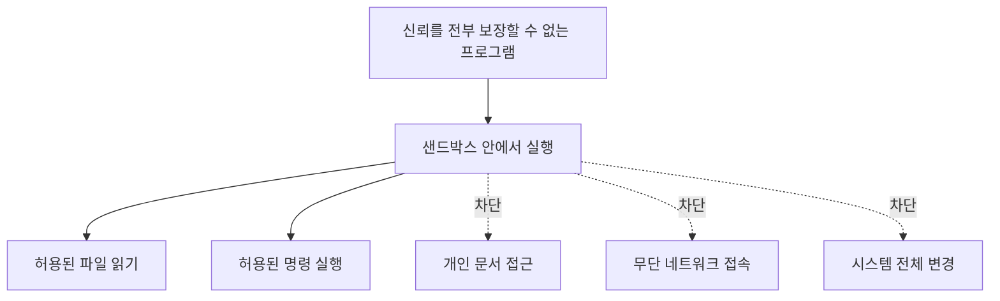
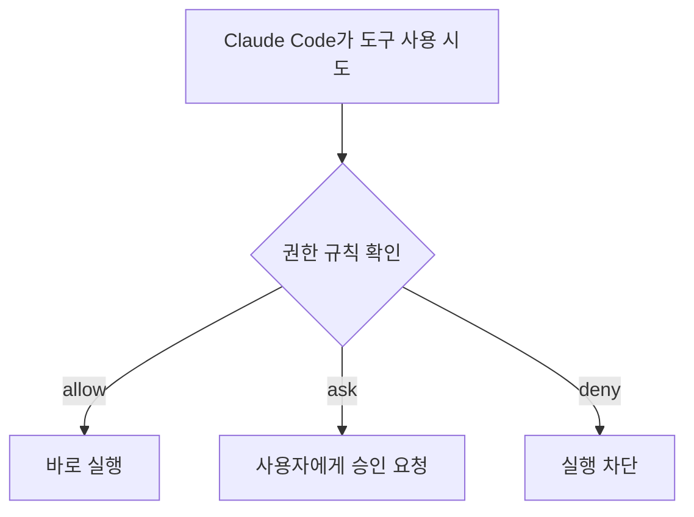

---
tags:
  - ai
  - codex
  - claude-code
  - sandbox
  - security
  - permissions
  - operating-system
---

# 🏖️ 샌드박스와 Codex 권한

> [!summary]
> 샌드박스는 **프로그램을 실행은 시키되, 접근할 수 있는 파일·네트워크·시스템 기능의 범위를 제한하여 문제가 생겨도 영향이 울타리 밖으로 퍼지지 않게 하는 보안 경계**다.

---

## 🤔 처음 헷갈렸던 점

Codex가 샌드박스 환경에서 명령을 실행한다는데, 샌드박스가 Codex를 위해 새로 만들어진 개념인지, WSL2나 가상 머신처럼 별도의 컴퓨터를 만드는 것인지 헷갈렸다.

결론부터 말하면 샌드박스는 Codex 전용 개념이 아니다. 컴퓨터 보안에서 오래 사용해 온 일반적인 설계 개념을, 자율적으로 파일을 수정하고 명령을 실행하는 Codex에도 적용한 것이다.

---

## 🧸 왜 이름이 샌드박스일까?

어린이가 모래를 흩뿌리며 놀더라도 모래 놀이터의 울타리 안에서만 일이 벌어지게 하는 모습에서 이해하면 쉽다.

```text
프로그램을 실행하도록 허용한다
              +
행동할 수 있는 범위를 제한한다
```

신뢰하기 어려운 프로그램을 아예 실행하지 못하게 하는 것이 아니라, 필요한 일은 할 수 있게 하면서 피해 가능 범위를 줄이는 것이 핵심이다.



> 샌드박스는 프로그램이 절대 실수하지 않을 것이라고 믿는 대신, **실수하더라도 어디까지 영향을 줄 수 있는지를 제한한다.**

---

## 🌍 이미 일상에서 사용하던 개념

### 웹 브라우저

웹사이트의 JavaScript는 내 컴퓨터에서 실행되지만 로컬 파일, 다른 사이트의 데이터, 카메라와 마이크 등에 마음대로 접근할 수 없다.

카메라가 필요할 때 브라우저가 사용자에게 권한을 묻는 흐름도 샌드박스와 승인 구조로 볼 수 있다.

```text
브라우저 샌드박스 → 카메라 접근을 기본 차단
사용자 승인       → 해당 사이트에 접근 허용
```

### 스마트폰 앱

스마트폰 앱은 각자의 데이터 영역에서 실행된다. 사진, 위치, 연락처 등이 필요하면 운영체제를 통해 사용자에게 권한을 요청한다. 한 앱이 다른 앱의 내부 데이터를 마음대로 읽지 못하도록 제한하는 것도 샌드박스의 대표적인 사례다.

### 온라인 코드 실행 서비스

코딩 테스트 사이트는 사용자가 제출한 코드를 직접 실행해야 한다. 무한 루프나 악의적인 코드가 서버 전체에 영향을 주지 않도록 다음과 같은 범위를 제한한다.

```text
실행 시간 2초
메모리 512MB
네트워크 접근 금지
지정된 파일 영역만 사용
```

### Java의 역사적 사례

과거 웹 브라우저에서 외부 Java 애플릿을 실행할 때도 로컬 파일, 네트워크와 시스템 기능 접근을 제한하는 Java 샌드박스 개념을 사용했다.

즉 AI 에이전트가 등장하기 전부터, **신뢰하기 어려운 코드를 필요한 범위 안에서 실행하기 위한 방법**으로 샌드박스가 사용되어 왔다.

---

## 🤖 Codex에는 왜 샌드박스가 필요할까?

Codex는 답변만 생성하는 것이 아니라 실제 개발 환경에서 다음 작업을 연속해서 수행할 수 있다.

```text
파일 탐색
  ↓
코드 수정
  ↓
명령 실행
  ↓
테스트
  ↓
필요하면 네트워크 접근
```

이 기능은 편리하지만 제한이 없다면 실수로 프로젝트 밖의 파일을 수정하거나, 비밀 정보에 접근하거나, 원하지 않는 네트워크 요청을 보낼 위험도 생긴다.

Codex의 로컬 샌드박스는 운영체제 수준의 보안 기능을 이용하여 Codex가 실행한 명령이 접근할 수 있는 범위를 제한한다. `git`, 패키지 관리자, 테스트 러너처럼 Codex가 실행한 하위 프로세스에도 같은 경계가 적용된다.

```text
내 컴퓨터
┌────────────────────────────────┐
│ 개인 문서 · SSH 키 · 다른 저장소 │ ← 수정 제한
│                                │
│  ┌── Codex 샌드박스 ─────────┐ │
│  │ 현재 프로젝트 읽기·수정    │ │
│  │ 테스트와 로컬 명령 실행    │ │
│  └───────────────────────────┘ │
└────────────────────────────────┘
```

공식 문서: [OpenAI — Codex Sandbox](https://learn.chatgpt.com/docs/sandboxing)

---

## 🔐 샌드박스와 승인은 다르다

Codex에서는 두 보안 장치가 함께 작동한다.

| 장치 | 결정하는 것 | 질문으로 표현하면 |
| --- | --- | --- |
| 샌드박스 | 기술적으로 허용된 행동 범위 | “어디까지 할 수 있는가?” |
| 승인 정책 | 행동 전에 사용자에게 물어볼 시점 | “언제 허락을 받아야 하는가?” |

예를 들어 샌드박스가 현재 프로젝트만 수정할 수 있도록 제한하고 있는데, 작업 도중 인터넷 접속이 필요해질 수 있다.

```text
Codex: 공식 문서를 가져오려면 네트워크 접근이 필요합니다.
사용자: 이번 명령은 허용합니다.
Codex: 승인된 범위로 명령을 실행합니다.
```

실제로 이 노트를 공부하던 중 Codex가 공식 매뉴얼을 가져오려 했을 때, 기본 네트워크 제한 때문에 첫 요청이 차단됐다. 이후 사용자 승인을 받은 뒤 같은 요청을 실행할 수 있었다.

> 샌드박스는 기본 울타리이고, 승인은 필요한 상황에 울타리 밖 행동을 허용할지 결정하는 절차다.

공식 문서: [OpenAI — Agent approvals & security](https://learn.chatgpt.com/docs/agent-approvals-security)

---

## 🎚️ Codex의 대표적인 샌드박스 모드

### `read-only`

파일과 코드를 조사하는 데 초점을 맞춘 모드다. 파일 변경은 허용하지 않으며, 변경을 일으키는 행동에는 승인이 필요할 수 있다.

```text
코드 읽기와 분석   가능
파일 수정          제한
```

코드 리뷰, 구조 분석, 원인 진단처럼 변경이 필요 없는 작업에 잘 맞는다.

### `workspace-write`

현재 작업 공간 안에서는 파일을 읽고 수정하며 일반적인 로컬 명령을 실행할 수 있다. 프로젝트 밖의 파일 수정과 네트워크 접근 등은 제한되거나 승인이 필요하다.

```text
현재 프로젝트 읽기·수정   가능
테스트 실행                가능
프로젝트 밖의 파일 수정    제한
네트워크 접근              기본적으로 제한
```

로컬 개발에서 자율성과 안전성의 균형을 잡기 좋은 일반적인 모드다.

### `danger-full-access`

파일 시스템과 네트워크에 대한 샌드박스 경계를 제거하는 모드다. Codex가 필요한 범위를 크게 넘어 행동할 수 있으므로, 통제된 환경에서 위험을 이해하고 사용할 때만 선택해야 한다.

> [!danger]
> 작업이 막힌다는 이유만으로 전체 권한을 주기보다, 필요한 디렉터리나 명령만 좁게 승인하는 편이 안전하다.

---

## 🟠 Claude Code는 샌드박스가 아닐까?

Claude Code도 OS 수준의 네이티브 샌드박스 기능을 제공한다. 다만 기본적인 안전장치는 **행동마다 허용·질문·차단을 결정하는 권한 시스템**이고, Bash 샌드박스는 별도로 활성화해서 사용하는 구조다.

> Claude Code가 샌드박스를 지원하지 않는 것이 아니다. 기본적으로는 권한 승인 시스템을 사용하고, 필요하면 그 위에 OS 수준의 Bash 샌드박스를 추가할 수 있다.

### Claude Code의 기본 권한 시스템

Claude Code는 도구 사용 규칙을 다음 세 종류로 나눌 수 있다.

| 규칙 | 동작 |
| --- | --- |
| `allow` | 사용자에게 묻지 않고 허용 |
| `ask` | 실행하기 전에 사용자에게 승인 요청 |
| `deny` | 실행 차단 |

예를 들어 파일 수정이나 Bash 명령을 실행하기 전에 다음과 같이 묻는 것은 권한 시스템의 동작이다.

```text
Claude가 이 명령을 실행하도록 허용할까요?
```



### 권한 규칙과 OS 샌드박스는 다르다

권한 규칙은 Claude Code가 어떤 도구를 사용하도록 허용할지 결정한다. 샌드박스는 Bash 명령과 그 하위 프로세스가 실제로 파일과 네트워크에 접근할 수 있는지를 운영체제 수준에서 제한한다.

```text
권한 규칙
→ “Claude야, 이 도구를 사용해도 되는가?”

OS 샌드박스
→ “실행된 프로세스가 실제로 이 자원에 접근할 수 있는가?”
```

이 차이가 중요한 이유는 Claude Code의 내장 파일 도구와 Bash가 서로 다른 접근 경로이기 때문이다.

```text
내장 Read 도구로 .env 읽기
→ Read 권한 규칙이 제어

Bash에서 cat .env 실행
→ Bash 명령과 OS 샌드박스가 제어
```

내장 `Read` 도구를 차단하는 규칙만으로는 Bash 하위 프로세스의 파일 접근을 OS 수준에서 막는 것과 같지 않다. 그래서 권한과 샌드박스를 함께 사용하면 서로 다른 층에서 방어할 수 있다.

공식 문서: [Anthropic — Configure permissions](https://code.claude.com/docs/en/permissions)

### Claude Code 샌드박스 활성화

Claude Code에서 다음 명령을 입력하면 샌드박스 설정 메뉴를 열 수 있다.

```text
/sandbox
```

샌드박스를 활성화하면 Bash 명령과 그 명령이 실행한 하위 프로세스에 파일 시스템 및 네트워크 경계가 적용된다.

- 기본적으로 현재 작업 디렉터리와 하위 디렉터리에 쓰기 가능
- 현재 작업 디렉터리 밖의 수정 제한
- 허용된 네트워크 도메인만 접근
- `npm`, `kubectl`, `terraform` 같은 하위 프로세스에도 같은 제한 적용

Claude Code 설정의 `sandbox.enabled` 기본값은 `false`다. 즉 샌드박스 기능은 제공되지만, 설정하거나 `/sandbox`에서 활성화했는지 확인해야 한다.

> [!warning]
> Claude Code의 Bash 샌드박스는 Bash 명령과 하위 프로세스에 적용된다. 내장 `Read`, `Edit`, `Write` 도구는 Claude Code의 권한 시스템으로 제어된다.

공식 문서: [Anthropic — Sandboxing](https://code.claude.com/docs/en/sandboxing)

### WSL2에서의 Claude Code 샌드박스

Claude Code는 Linux와 WSL2에서 `bubblewrap`을 이용해 샌드박스를 구현한다. 공식 문서에서 안내하는 Ubuntu·Debian 계열의 필요 패키지는 다음과 같다.

```bash
sudo apt-get install bubblewrap socat
```

WSL1에는 필요한 Linux 커널 기능이 없어 지원되지 않지만 WSL2에서는 사용할 수 있다.

### Codex와 Claude Code 비교

| 구분 | Codex 로컬 실행 | Claude Code |
| --- | --- | --- |
| 기본 보호의 중심 | OS 샌드박스와 승인 정책 | 도구별 권한 승인 시스템 |
| 일반적인 프로젝트 작업 | `workspace-write` 경계 안에서 수행 | 권한 모드와 규칙에 따라 승인 |
| OS 수준 샌드박스 | 기본 로컬 권한 구성에 포함 | 네이티브 Bash 샌드박스를 별도로 활성화 가능 |
| 샌드박스 적용 대상 | Codex가 실행한 명령과 하위 프로세스 | Bash 명령과 하위 프로세스 |
| WSL2 | Linux 샌드박스 구현 사용 | `bubblewrap` 사용 |

둘 다 사용자가 자율성과 안전성의 균형을 조절할 수 있다. 차이는 **Codex는 샌드박스 경계를 기본 작업 모델의 중심에 두고, Claude Code는 도구별 승인 시스템을 기본으로 하면서 선택형 Bash 샌드박스를 추가한다**는 데 있다.

---

## 🗄️ 백엔드 관점의 비유

샌드박스는 애플리케이션용 DB 계정에 필요한 권한만 부여하는 것과 비슷하다.

```sql
GRANT SELECT, INSERT, UPDATE ON mogi_db.* TO app_user;
```

애플리케이션이 사용하는 DB 계정에 모든 데이터베이스를 삭제할 수 있는 관리자 권한까지 줄 필요는 없다.

```text
DB 최소 권한
→ 애플리케이션이 필요한 테이블과 명령만 허용

Codex 샌드박스
→ 에이전트가 필요한 파일과 명령만 허용
```

둘 다 **작업에 필요한 최소 권한만 준다**는 최소 권한 원칙을 따른다.

---

## 🐧 VM·컨테이너·샌드박스는 어떻게 다를까?

| 개념 | 핵심 목적 |
| --- | --- |
| VM | 가상 하드웨어 위에서 별도의 운영체제 실행 |
| 컨테이너 | 애플리케이션과 사용자 공간의 실행 환경 격리 |
| 샌드박스 | 프로그램이 할 수 있는 행동과 접근 범위 제한 |

샌드박스는 이루고 싶은 **보안 목적 또는 경계**에 가깝고, VM·컨테이너·운영체제 권한은 그 경계를 구현하는 수단으로 사용될 수 있다.

Codex를 WSL2에서 실행한다면 다음처럼 이해할 수 있다.

```text
Windows
└── WSL2 VM
    └── Linux
        └── Codex
            └── 샌드박스가 허용한 작업 범위
```

WSL2가 Linux 실행 환경을 제공한다고 해서 그 안의 Codex가 WSL2 전체에 자유롭게 접근해야 하는 것은 아니다. Linux의 보안 기능을 사용해 Codex가 실행하는 명령에 별도의 샌드박스 경계를 적용할 수 있다.

관련 노트: [WSL2는 가상 머신일까?](../operating-system/wsl2-managed-lightweight-vm.md)

관련 노트: [코딩 에이전트의 두뇌는 어디에 있을까?](coding-agent-local-cli-and-cloud-model.md)

---

## ⚠️ 샌드박스가 있으면 완전히 안전할까?

샌드박스는 위험을 없애는 것이 아니라 **피해 가능한 범위를 줄인다.**

Codex가 현재 프로젝트를 수정할 수 있다면 잘못된 수정으로 프로젝트 코드가 깨질 가능성은 여전히 있다. 따라서 Git으로 변경 사항을 관리하고, 중요한 명령은 확인하며, 필요 이상의 권한을 주지 않아야 한다.

```text
샌드박스 없음
실수 → 컴퓨터 전체에 영향을 줄 가능성

샌드박스 있음
실수 → 허용된 작업 공간 안으로 영향 제한
```

> [!warning]
> 샌드박스는 “이 프로그램은 안전하다”는 보증이 아니다. “문제가 생겼을 때 영향을 줄 수 있는 범위를 제한한다”는 방어선이다.

---

## 💬 한 문장으로 설명하면

> Codex 샌드박스는 별도의 가상 컴퓨터라기보다, “이 프로젝트 안에서는 자율적으로 일해도 되지만 울타리 밖의 파일이나 네트워크가 필요하면 허락을 받아라”라고 정한 운영체제 수준의 권한 경계다.

---

## 복습 질문

- [ ] 샌드박스는 프로그램을 실행하면서 무엇을 제한하는가?
- [ ] 브라우저와 스마트폰 앱에서 샌드박스가 필요한 이유는 무엇인가?
- [ ] Codex의 샌드박스와 승인 정책은 각각 무엇을 결정하는가?
- [ ] `read-only`, `workspace-write`, `danger-full-access`는 어떻게 다른가?
- [ ] Claude Code의 권한 시스템과 Bash 샌드박스는 어떻게 다른가?

## 한 줄 회고

- 헷갈렸던 점: 샌드박스는 AI를 위한 가상 컴퓨터가 아니라 **프로그램의 행동 범위와 피해 범위를 제한하는 보안 경계**이며, Codex와 Claude Code는 그 경계와 승인 시스템을 적용하는 기본 방식이 다르다.
