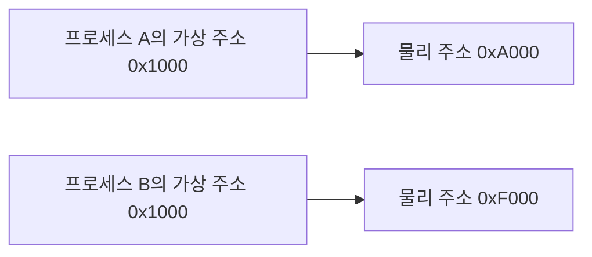

---
tags:
  - operating-system
  - memory
---

# 프로세스마다 독립된 가상 주소 공간이 있다는 뜻

> [!question]
> 내가 물어본 질문:
>
> - 프로세스마다 독립된 가상 주소 공간이 있다는 게 무슨 뜻인가?
> - 같은 주소를 여러 프로세스가 써도 왜 서로 충돌하지 않는가?
> - 가상 주소와 실제 RAM 주소는 어떻게 다른가?

> [!summary]
> 결론:
>
> - 각 프로세스는 자기만의 가상 주소 공간을 가진다.
> - 같은 `0x1000`이라는 주소라도 프로세스마다 실제 RAM의 다른 위치를 가리킬 수 있다.
> - 운영체제와 MMU가 가상 주소를 물리 주소로 변환해준다.
> - 이 구조 덕분에 프로세스 간 메모리 격리, 보안, 편한 프로그래밍 모델이 가능해진다.

## 먼저 잡을 한 줄 정의

> [!info]
> 가상 메모리는 각 프로세스에게 "메모리 전체를 나 혼자 쓰는 것처럼" 보이게 하고, 실제 RAM과는 운영체제와 MMU가 페이지 단위로 연결해주는 구조다.

## 왜 헷갈렸나

- 주소라고 하면 실제 RAM의 고정된 위치를 바로 떠올리기 쉽다.
- 그래서 프로세스 A와 프로세스 B가 같은 `0x1000` 주소를 쓰면 충돌할 것처럼 느껴진다.
- 하지만 애플리케이션이 보는 주소는 대부분 물리 주소가 아니라 가상 주소다.

## 실제 동작 흐름

프로그램 A와 프로그램 B가 동시에 실행 중이라고 해보자.

```text
프로세스 A
프로세스 B
```

둘 다 자기 코드 안에서는 같은 주소를 쓸 수 있다.

```text
프로세스 A의 0x1000
프로세스 B의 0x1000
```

하지만 실제 RAM에서는 같은 위치가 아니다.

```text
프로세스 A의 가상 주소 0x1000 -> 실제 RAM의 0xA000
프로세스 B의 가상 주소 0x1000 -> 실제 RAM의 0xF000
```

즉 `0x1000`이라는 주소는 프로세스마다 의미가 다르다.



## OS와 MMU의 역할

프로그램이 메모리에 접근할 때 사용하는 주소는 가상 주소다.

```text
프로그램이 보는 주소
= 가상 주소

실제 RAM 주소
= 물리 주소
```

가상 주소를 물리 주소로 바꾸는 과정은 운영체제와 MMU가 처리한다.

> [!info]
> MMU는 Memory Management Unit의 줄임말이다.
> CPU 근처에 있는 메모리 관리 장치로, 가상 주소를 물리 주소로 변환하는 일을 도와준다.

동작 흐름은 다음과 같다.

```text
프로그램: 0x1000 읽어줘
CPU/MMU: 이 프로세스의 0x1000은 실제 RAM 0xA000이네
RAM: 0xA000에 있는 값 반환
```

## 왜 이런 구조가 필요한가

### 1. 프로세스 격리

프로세스 A에 버그가 있어도 프로세스 B의 메모리를 마음대로 망가뜨리면 안 된다.

```text
프로세스 A 버그
-> 잘못된 주소 접근
-> A만 죽어야 함
-> B까지 망가지면 안 됨
```

가상 주소 공간이 분리되어 있으면, 각 프로세스는 자기 주소 공간 안에서만 움직인다.

### 2. 편한 프로그래밍 모델

프로그램은 실제 RAM 어디에 올라갔는지 신경 쓰지 않아도 된다.

```text
프로그램 입장:
내 배열은 0x1000 근처에 있음

OS 입장:
그 가상 주소를 실제 RAM 어딘가에 매핑해줌
```

덕분에 프로그램은 "내가 독립된 메모리 공간을 가진다"고 생각하고 작성될 수 있다.

### 3. 보안과 권한 관리

운영체제는 페이지 단위로 권한을 줄 수 있다.

```text
code 영역  : 읽기 + 실행 가능
data 영역  : 읽기 + 쓰기 가능
stack 영역 : 읽기 + 쓰기 가능
```

코드 영역을 수정하려 하거나, 스택에 있는 데이터를 실행하려 하면 운영체제와 하드웨어가 막을 수 있다.

## 백엔드 관점의 비유

> [!example]
> 각 사용자에게 같은 `/home` 경로가 보이지만 실제 저장소는 다르게 매핑되는 것과 비슷하다.
>
> ```text
> 사용자 A가 보는 /home -> 실제 storage/a-home
> 사용자 B가 보는 /home -> 실제 storage/b-home
> ```
>
> 사용자 입장에서는 둘 다 `/home`이지만, 실제 데이터는 분리되어 있다.

프로세스도 마찬가지다.

```text
프로세스 A가 보는 0x1000 -> 실제 RAM 어딘가
프로세스 B가 보는 0x1000 -> 실제 RAM의 다른 곳
```

## 자바 코드에서 보면

자바 코드에서는 그냥 객체를 만든 것처럼 보인다.

```java
User user = new User();
```

하지만 아래에서는 여러 층이 관여한다.

```text
Java 코드
-> JVM이 객체를 heap에 할당
-> heap은 프로세스의 가상 주소 공간 안에 있음
-> OS/MMU가 가상 주소를 실제 RAM과 연결
```

애플리케이션 코드는 보통 물리 주소를 직접 보지 않는다.

## 비교해서 이해하기

| 헷갈린 것 | 실제 의미 | 기억할 점 |
| --- | --- | --- |
| 주소 | 애플리케이션이 보는 주소는 보통 가상 주소 | 물리 RAM 주소와 바로 같다고 생각하면 헷갈린다 |
| 같은 `0x1000` | 프로세스마다 다른 의미를 가질 수 있음 | 같은 숫자여도 다른 주소 공간에 속할 수 있다 |
| RAM | 실제 물리 메모리 | OS/MMU가 가상 주소와 연결한다 |
| 메모리 보호 | 프로세스와 영역별 접근 권한 관리 | 잘못된 접근은 해당 프로세스만 죽게 만들 수 있다 |

## 주의할 점

> [!warning]
> 가상 주소 공간이 독립적이라는 말은 각 프로세스가 실제 RAM을 전부 혼자 가진다는 뜻이 아니다.
> 실제 RAM은 운영체제가 관리하고, 각 프로세스에게 독립된 주소 공간처럼 보이게 매핑해준다.

> [!warning]
> 같은 주소값이 보여도 같은 물리 메모리를 뜻하지 않을 수 있다.
> 주소는 어느 프로세스의 주소 공간에서 해석하느냐가 중요하다.

## 면접에서 말하면

> [!tip]
> 프로세스마다 독립된 가상 주소 공간이 있다는 것은 각 프로세스가 자기만의 메모리 공간을 가진 것처럼 실행된다는 뜻입니다. 같은 가상 주소라도 프로세스마다 다른 물리 메모리에 매핑될 수 있고, 이 변환은 운영체제와 MMU가 처리합니다. 이 구조 덕분에 프로세스 간 메모리 격리, 보안, 그리고 편한 프로그래밍 모델이 가능해집니다.

## 내가 다시 헷갈릴 것 같은 부분

- `0x1000` 같은 주소 숫자가 같아도 프로세스가 다르면 다른 물리 메모리를 가리킬 수 있다.
- 가상 메모리는 실제 RAM을 복사해서 각 프로세스에 나눠주는 것이 아니라, 주소 공간을 독립적으로 보이게 매핑하는 구조다.
- 애플리케이션 코드는 대부분 물리 주소를 직접 보지 않는다.
- 코드 영역, 데이터 영역, 힙, 스택의 권한 관리는 가상 메모리와 페이지 권한 위에서 이루어진다.

## 복습 질문

- [ ] 프로세스마다 독립된 가상 주소 공간이 있다는 말은 무슨 뜻인가?
- [ ] 같은 `0x1000` 주소를 두 프로세스가 써도 충돌하지 않을 수 있는 이유는 무엇인가?
- [ ] 가상 주소와 물리 주소는 무엇이 다른가?
- [ ] OS와 MMU는 메모리 접근에서 어떤 역할을 하는가?
- [ ] 가상 메모리가 프로세스 격리와 보안에 어떻게 도움을 주는가?

## 한 줄 회고

- 헷갈렸던 점: 주소값이 같으면 같은 RAM 위치를 뜻한다고 생각하기 쉽지만, 프로세스마다 독립된 가상 주소 공간이 있어서 같은 주소값도 서로 다른 물리 메모리로 매핑될 수 있다는 점.
