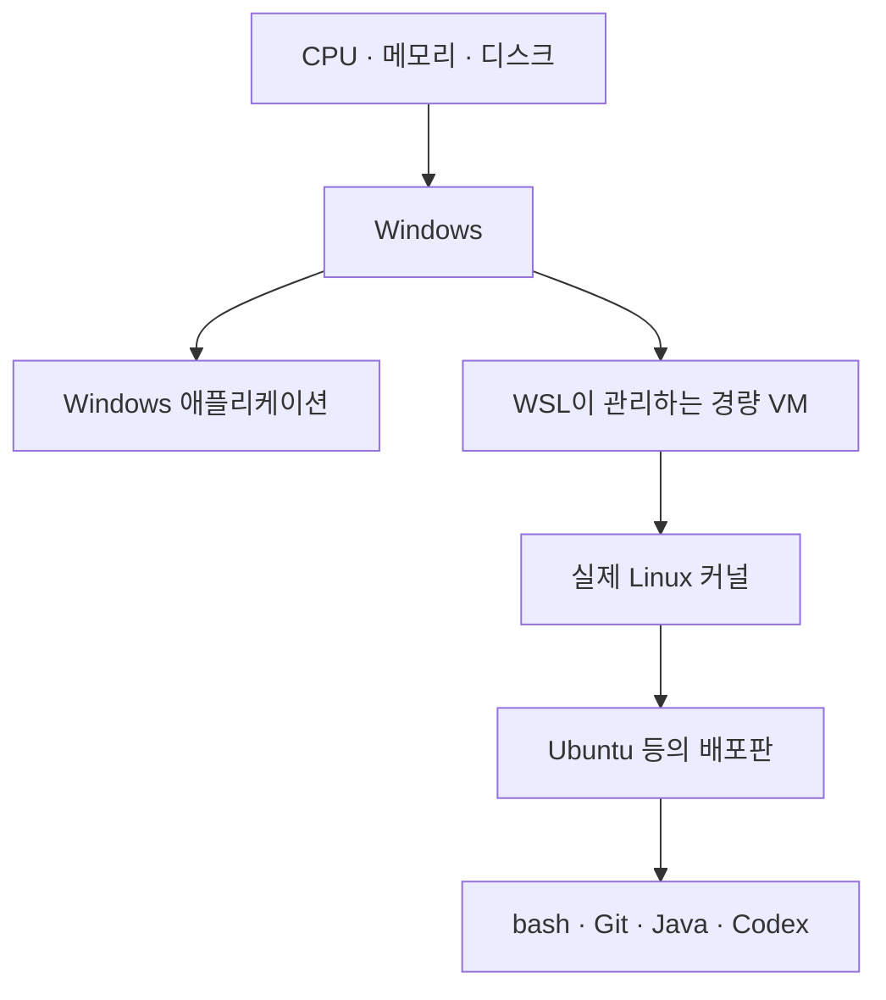

---
tags:
  - operating-system
  - windows
  - linux
  - wsl2
  - virtualization
  - development-environment
---

# 🐧 WSL2는 가상 머신일까?

> [!summary]
> WSL2는 **실제 Linux 커널을 경량 가상 머신에서 실행하되, VM의 생성과 관리를 Windows가 대신해 주는 Linux 개발 환경**이다.

---

## 🤔 처음 헷갈렸던 점

Windows에서 Codex를 직접 사용할 때는 경로, 셸, 권한 등의 차이 때문에 우회가 자주 필요했다. WSL2에 설치하니 macOS에서 사용할 때처럼 훨씬 자연스럽게 동작했다.

그런데 WSL2가 Linux를 제공한다면 VirtualBox 같은 가상 머신인지, 가상 머신이 아니라면 대체 무엇인지 헷갈렸다.

> WSL2는 가상화 기술을 사용한다. 다만 사용자가 별도의 컴퓨터처럼 직접 관리하는 전통적인 VM이 아니라, **Windows에 깊게 통합된 관리형 경량 VM**에 가깝다.

---

## 🧠 WSL2의 정체

일반적인 가상 머신에서는 사용자가 CPU, 메모리, 가상 디스크, 네트워크 등을 설정하고 게스트 OS를 직접 설치한다. WSL2도 내부적으로 가상 머신을 사용하지만, 이 관리 작업을 Windows와 WSL이 대부분 감춘다.



Ubuntu 터미널을 열었을 때는 평범한 Linux처럼 보이지만, 그 아래에는 Windows의 가상화 기능으로 실행되는 실제 Linux 커널이 있다.

### WSL1과 WSL2

WSL1은 Linux 시스템 호출을 Windows가 이해할 수 있도록 변환하는 방식이었다. 반면 WSL2는 실제 Linux 커널이 Linux 시스템 호출을 직접 처리한다.

| 구분 | WSL1 | WSL2 |
| --- | --- | --- |
| Linux 커널 | 실제 커널 없음 | 실제 Linux 커널 사용 |
| 핵심 방식 | Linux 요청을 Windows 방식으로 변환 | 경량 VM 안에서 Linux를 실행 |
| Linux 호환성 | 변환 계층의 제약이 있음 | 일반 Linux에 훨씬 가까움 |
| 가상화 | 전통적인 VM을 사용하지 않음 | 가상화 기술을 사용함 |

---

## 🖥️ VirtualBox와 무엇이 다를까?

| 관점 | WSL2 | VirtualBox·VMware의 일반적인 VM |
| --- | --- | --- |
| 주된 목적 | Windows에서 Linux 개발 도구 사용 | 독립된 컴퓨터와 OS 실행 |
| OS 설치와 부팅 | WSL이 대부분 자동 관리 | 사용자가 직접 설치하고 관리 |
| 자원 관리 | 필요에 따라 비교적 자동으로 조절 | CPU·메모리 등을 명시적으로 할당 |
| Windows 연동 | 파일, 명령어, 네트워크가 밀접하게 연동 | 별도의 공유 폴더·네트워크 설정이 필요할 수 있음 |
| 사용 경험 | 터미널을 열어 곧바로 Linux 사용 | VM을 켜고 게스트 OS에 접속 |

따라서 **“WSL2는 VM이 아니다”**라고 단정하면 부정확하다. 정확한 표현은 다음과 같다.

> WSL2는 내부적으로 VM을 사용하지만, VirtualBox처럼 VM 한 대를 직접 운영하는 경험을 제공하지는 않는다.

---

## 📦 여러 종류의 ‘가상환경’ 구분하기

개발에서 가상환경이라는 표현은 격리 범위가 서로 다른 기술에 두루 사용된다.

| 기술 | 주로 격리하는 것 | 예시 |
| --- | --- | --- |
| 언어 가상환경 | 언어별 패키지와 버전 | Python `venv` |
| 컨테이너 | 애플리케이션과 실행에 필요한 사용자 공간 | Docker |
| WSL2 | Windows 안의 Linux 개발 환경 | WSL2 Ubuntu |
| 전통적인 VM | 하드웨어에 가까운 환경과 전체 게스트 OS | VirtualBox, VMware |

Python `venv`는 Python 패키지를 분리할 뿐 Linux를 제공하지 않는다. Docker 컨테이너도 보통 호스트의 커널을 공유한다. WSL2는 실제 Linux 커널을 실행한다는 점에서 둘과 층위가 다르다.

---

## 🤖 Codex가 WSL2에서 더 자연스러운 이유

많은 개발 도구와 자동화 스크립트는 Linux나 macOS 같은 Unix 계열 환경을 기본으로 가정한다. Windows를 직접 사용할 때는 다음 차이를 별도로 처리해야 할 수 있다.

- PowerShell과 `bash`의 명령 및 문법 차이
- `C:\Users\mogi`와 `/home/mogi`의 경로 표현 차이
- 파일 권한과 실행 권한의 차이
- `CRLF`와 `LF` 줄바꿈 차이
- 심볼릭 링크와 대소문자 처리 차이
- `bash`를 전제로 작성된 셸 스크립트

WSL2 안에서 Codex를 실행하면 Codex가 보는 환경은 일반적인 Linux와 매우 비슷해진다. 그래서 Linux용 명령과 스크립트를 그대로 사용할 수 있고, Windows 전용 우회가 줄어든다.

macOS는 Linux는 아니지만 둘 다 Unix 계열의 개발 환경을 제공하므로 셸, 경로, 권한 같은 기본 관습이 비교적 비슷하다.

---

## 🌐 VM인데 왜 Windows에서 `localhost`로 접속될까?

WSL2 터미널에서 다음과 같이 개발 서버를 실행했다고 하자.

```bash
pnpm dev
```

서버 프로세스는 Windows가 아니라 WSL2의 Linux 안에서 실행된다. 그런데도 Windows의 브라우저에서 다음 주소로 접속할 수 있다.

```text
http://localhost:3000
```

이것은 WSL2가 VM이 아니라는 증거가 아니다. **WSL이 Windows의 `localhost`로 들어온 연결을 Linux VM 안의 서버까지 자동으로 이어주기 때문**이다.


일반적인 VM에서도 포트 포워딩을 직접 설정하면 호스트의 포트와 게스트 VM의 포트를 연결할 수 있다. WSL2는 Windows에서 Linux 개발 서버를 편리하게 사용할 수 있도록 이 연동을 기본 기능으로 제공한다는 점이 다르다.

> VM이라는 말은 커널과 실행 환경이 가상화되어 있다는 뜻이지, 호스트와 네트워크가 반드시 단절되어야 한다는 뜻은 아니다.

### 기본 NAT 모드

WSL2는 기본적으로 NAT 기반 네트워크를 사용한다. 이때 Windows와 WSL2 VM은 서로 다른 IP 주소를 가질 수 있다.

PowerShell에서 WSL2의 IP 주소를 확인할 수 있다.

```powershell
wsl hostname -I
```

내부적으로 IP가 분리되어 있더라도, Windows에서 WSL2의 Linux 네트워크 애플리케이션으로 접속할 때는 WSL의 localhost 전달 기능 덕분에 보통 별도 IP 대신 `localhost`를 사용할 수 있다.

```text
Windows localhost:3000
        ↓ WSL의 localhost 전달
WSL2의 별도 IP:3000
        ↓
Linux에서 실행 중인 개발 서버
```

### Mirrored 네트워크 모드

Mirrored 모드에서는 Windows의 네트워크 인터페이스를 Linux에 미러링하여 Windows와 WSL2 사이의 네트워크를 더 밀접하게 통합한다. 이 모드에서는 Windows와 WSL2가 서로의 서버에 `127.0.0.1`을 사용해 접속할 수 있다.

모드마다 내부 연결 방식에는 차이가 있지만, `pnpm dev`로 실행한 WSL2 서버를 Windows 브라우저의 `localhost`에서 열 수 있다는 사용자 경험은 비슷할 수 있다.

### 백엔드 관점에서 이해하기

Windows와 WSL의 네트워크 연동을 개발 서버 앞의 프록시나 포트 포워딩처럼 생각하면 쉽다.

```text
GET http://localhost:3000
            ↓
Windows · WSL 연결 계층
            ↓
WSL2 Linux 안의 Node 서버
            ↓
HTTP 응답
```

브라우저에서는 내 컴퓨터의 `localhost`에 접속한 것처럼 보이지만, 요청을 처리하는 Node 프로세스, Node 버전, 환경변수와 파일은 여전히 WSL2의 Linux 환경에 속한다.

> [!warning]
> `localhost`로 접속된다는 사실과 Windows 및 Linux의 실행 환경이 같다는 것은 전혀 다른 이야기다. **실행 환경은 분리되어 있고, 개발 편의를 위한 네트워크 통로가 연결되어 있는 것**이다.

다른 PC나 휴대폰 등 외부 장치에서 이 서버에 접속하는 것은 Windows 자신의 `localhost` 접속과 별개의 문제다. 서버의 바인딩 주소, Windows 방화벽과 WSL 네트워크 설정을 추가로 확인해야 하며, 서버를 `0.0.0.0`에 바인딩하면 외부에 노출될 가능성도 함께 고려해야 한다.

참고: [Microsoft Learn — Accessing network applications with WSL](https://learn.microsoft.com/en-us/windows/wsl/networking)

관련 노트: [포트 포워딩은 왜 할까?](../network/port-forwarding-basics.md)

---

## 📁 프로젝트는 어디에 둘까?

WSL2에서 주로 작업한다면 프로젝트도 Linux 파일 시스템 안에 두는 편이 좋다.

권장 위치:

```text
/home/mogi/projects/my-server
```

Windows의 C 드라이브를 WSL에서 접근한 위치:

```text
/mnt/c/Users/mogi/projects/my-server
```

`/mnt/c`에서도 작업할 수 있지만, Windows와 Linux 파일 시스템 사이를 오가기 때문에 많은 작은 파일을 읽고 쓰는 작업이 느려질 수 있다. 파일 권한, 대소문자 구분, 파일 변경 감시에서도 예상하지 못한 차이를 만날 수 있다.

> [!tip]
> WSL에서 Git, 빌드 도구, Codex를 실행한다면 저장소도 `/home/...` 아래에 두고 작업하는 것을 우선 고려한다.

Windows 탐색기에서는 주소창에 다음 경로를 입력해 WSL의 파일에 접근할 수 있다.

```text
\\wsl$\
```

---

## ⚠️ 기억할 경계

- WSL2는 Windows를 Linux로 바꾸는 것이 아니다. Windows와 Linux가 함께 동작한다.
- WSL2의 Ubuntu는 Windows와 완전히 독립된 별도 컴퓨터도 아니다. 파일과 명령을 서로 호출할 수 있도록 통합돼 있다.
- Windows에 설치한 프로그램과 WSL에 설치한 프로그램은 기본적으로 별개의 설치다. 예를 들어 Git이나 Java가 어느 쪽에 설치됐는지 확인해야 한다.
- Windows 터미널에서 작업 중인지 WSL의 Linux 셸에서 작업 중인지 항상 구분한다.
- WSL2를 강한 보안 격리 공간으로 간주하면 안 된다. Windows와의 편리한 상호 운용이 목적인 개발 환경이다.

---

## 🛠️ 상태를 확인하는 기본 명령어

PowerShell에서 설치된 배포판과 WSL 버전을 확인한다.

```powershell
wsl --list --verbose
```

WSL 환경에 진입한다.

```powershell
wsl
```

실행 중인 WSL 환경을 모두 종료한다.

```powershell
wsl --shutdown
```

WSL 안에서 현재 Linux 배포판 정보를 확인한다.

```bash
cat /etc/os-release
```

---

## 💬 한 문장으로 설명하면

> WSL2는 Windows가 자동으로 관리하는 경량 VM에서 실제 Linux 커널을 실행하여, Windows 안에서도 Linux 개발 환경을 자연스럽게 사용할 수 있게 해주는 기술이다.

---

## 복습 질문

- [ ] WSL2를 관리형 경량 VM이라고 부르는 이유는 무엇인가?
- [ ] WSL1과 WSL2는 Linux 시스템 호출을 어떻게 다르게 처리하는가?
- [ ] WSL2와 VirtualBox를 사용할 때의 경험은 어떻게 다른가?
- [ ] WSL2의 개발 서버를 Windows 브라우저에서 `localhost`로 열 수 있는 이유는 무엇인가?
- [ ] Codex를 WSL2에서 실행하고 프로젝트를 `/home` 아래에 두면 좋은 이유는 무엇인가?

## 한 줄 회고

- 헷갈렸던 점: WSL2는 가상 머신이 아닌 것이 아니라, **VM 관리가 Windows 뒤로 감춰졌고 실행 환경은 분리된 채 네트워크 통로가 연결된 형태**였다.
