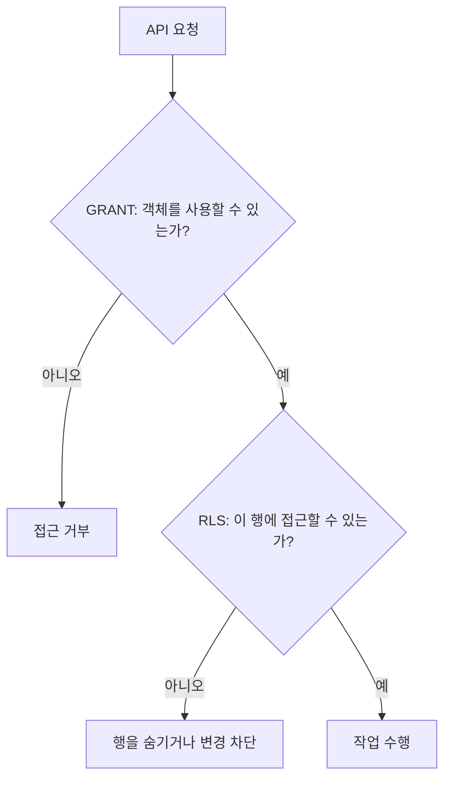

---
tags:
  - backend
  - postgres
  - supabase
  - security
review_answered: false
---

# Supabase 레거시 시퀀스 권한과 RLS 사각지대

> [!summary]
> 오래된 Supabase 프로젝트에서는 `anon`, `authenticated`, `service_role`에 시퀀스 전체 권한이 기본으로 부여될 수 있다. 테이블은 RLS라는 두 번째 방어선이 있지만 시퀀스에는 RLS가 없으므로, 불필요한 시퀀스 권한과 이를 재생성하는 default ACL을 직접 회수해야 한다.

## 처음 궁금했던 질문

사이드 프로젝트의 권한을 점검하다가 모든 시퀀스에서 다음과 같은 ACL을 발견했다.

```text
anon=rwU/supabase_admin
```

왜 익명 사용자 역할인 `anon`이 모든 시퀀스에 전체 권한을 가지고 있었을까? 우리가 마이그레이션에서 잘못 열어둔 것일까, 아니면 Supabase가 만든 기본 설정일까?

결론부터 말하면 이 프로젝트에서는 **과거 Supabase의 기본 프로비저닝이 남긴 권한**이었다. 애플리케이션 마이그레이션이 임의로 연 권한이 아니었다.

---

## 🎟️ 시퀀스는 번호표 발급기다

PostgreSQL의 시퀀스는 자동 증가 ID처럼 연속된 숫자를 발급하는 객체다.

```sql
CREATE TABLE posts (
  id bigint GENERATED BY DEFAULT AS IDENTITY PRIMARY KEY
);
```

새로운 `posts` 행에 1, 2, 3 같은 ID를 붙일 때 내부 시퀀스가 다음 값을 발급한다. 테이블에 딸린 부속품처럼 보이지만, 권한 관점에서는 테이블과 별개의 데이터베이스 객체다.

> [!info] MSSQL 관점의 결론
> 시퀀스는 Supabase 전용이 아니라 여러 관계형 데이터베이스에서 사용하는 일반적인 개념이다. MSSQL에서는 자동 증가에 테이블 붙박이인 `IDENTITY`를 주로 사용해서 시퀀스를 별도 객체로 의식할 일이 적지만, MSSQL 2012 이상도 독립적인 `CREATE SEQUENCE`를 지원한다. PostgreSQL의 자동 증가 컬럼 뒤에는 독립된 시퀀스 객체가 연결되므로 테이블과 시퀀스의 권한이 따로 관리된다.
>
> RLS는 행이 있는 테이블에 적용하는 정책이므로 시퀀스에는 붙일 수 없다. 따라서 테이블은 `GRANT`와 RLS라는 두 개의 문으로 보호할 수 있지만, 시퀀스는 `GRANT` 하나로만 보호한다. 이번 PR은 시퀀스에 RLS를 설정한 것이 아니라 `anon`에게 열려 있던 유일한 문인 시퀀스 권한을 회수한 작업이다.

### `rwU`가 의미하는 권한

| ACL 문자 | SQL 권한 | 할 수 있는 일 |
| --- | --- | --- |
| `r` | `SELECT` | 시퀀스 값을 읽는다 |
| `w` | `UPDATE` | 다음 값을 만들거나 `setval()`로 값을 변경한다 |
| `U` | `USAGE` | `nextval()`, `currval()` 등을 사용한다 |

따라서 `anon=rwU`는 `anon`이 해당 시퀀스에 사실상 모든 권한을 가졌다는 뜻이다.

```sql
SELECT nextval('posts_id_seq');
SELECT setval('posts_id_seq', 1);
```

권한과 실행 경로가 모두 노출되어 있다면 다음 값을 반복해서 소모하거나, 값을 되감아 이후 INSERT에서 기본 키 충돌을 유발할 수 있다.

> [!warning]
> `anon`에 시퀀스 권한이 있다는 사실만으로 Supabase REST API에서 누구나 곧바로 임의의 SQL을 실행할 수 있다는 뜻은 아니다. 실제 악용에는 노출된 RPC나 함수 같은 실행 경로도 필요할 수 있다. 하지만 익명 역할에 필요 없는 강한 권한이 존재하는 것은 제거해야 할 위험이다.

---

## 🔐 테이블에는 RLS가 있지만 시퀀스에는 없다

Supabase의 데이터 접근은 보통 객체 권한인 `GRANT`와 행 단위 규칙인 RLS를 함께 거친다.



테이블은 `anon`에게 객체 접근 권한을 넓게 주더라도 RLS에서 사용자가 접근할 수 있는 행을 다시 제한할 수 있다. 아파트로 비유하면 공동현관을 통과한 뒤에도 각 집의 도어록을 한 번 더 확인하는 구조다.

하지만 **시퀀스에는 RLS를 적용할 수 없다.**

```text
시퀀스 접근 → GRANT 확인 → 작업 수행
```

시퀀스에서는 `GRANT`가 사실상 유일한 자물쇠다. 따라서 시퀀스에 `anon=rwU`를 부여하면 테이블처럼 뒤에서 막아줄 행 단위 규칙이 없다. 테이블 권한을 넓게 열고 RLS에서 제어하는 모델을 시퀀스까지 그대로 적용하면 사각지대가 생기는 이유다.

---

## 🚪 정책이 없는 것과 GRANT 회수는 다르다

RLS 정책이 없을 때와 `GRANT`를 회수했을 때는 지금 당장 요청이 거부된다는 결과만 같다. **어느 보안 계층에서, 왜 거부됐는지**는 다르다.

PostgreSQL은 먼저 객체 권한인 `GRANT`를 확인하고, 이를 통과한 요청에 RLS 정책을 적용한다.

```text
anon의 INSERT 요청
  ↓
GRANT: 이 테이블에 INSERT할 자격이 있는가?
  ↓ 통과
RLS: 새 행을 허용하는 정책을 통과하는가?
  ↓ 통과
INSERT 성공
```

| GRANT | RLS | 결과 |
| --- | --- | --- |
| 허용 | 허용 | 작업 성공 |
| 허용 | 정책 없음 또는 거부 | RLS에서 차단 |
| 회수 | 허용 | GRANT에서 차단 |
| 회수 | 정책 없음 또는 거부 | GRANT에서 먼저 차단 |

RLS가 활성화된 테이블에 적용 가능한 정책이 없으면 기본 거부가 적용된다. 그러나 이는 테이블 사용 자격을 없앤 것이 아니라, **현재 통과할 수 있는 허용 정책이 없는 상태**다.

```sql
CREATE POLICY allow_anon_insert
ON public.example
FOR INSERT
TO anon
WITH CHECK (true);
```

테이블의 `INSERT` 권한이 여전히 남아 있다면 위와 같은 허용 정책 한 줄이 추가되는 순간 `anon`의 INSERT가 성공할 수 있다. RLS를 실수로 비활성화해도 같은 문제가 생긴다.

반대로 객체 권한을 회수하면 정책 목록과 관계없이 첫 번째 문에서 요청이 거부된다.

```sql
REVOKE INSERT ON TABLE public.example FROM anon;
```

허용 RLS 정책이 추가되거나 RLS 자체가 꺼져도 `anon`은 테이블에 INSERT할 자격이 없으므로 `permission denied`가 발생한다. 필요 없는 `GRANT`를 회수하는 것은 미래의 정책 오추가와 RLS 비활성화 실수까지 견디게 하는 별도의 방어선이다.

### 리뷰어가 차이를 재현한 순서

1. 수정 전에는 `anon` INSERT가 거부되어 안전해 보였다.
2. `WITH CHECK (true)` 허용 정책을 추가하고 ID를 직접 지정하자 `INSERT 0 1`로 한 행이 실제 삽입됐다.
3. `GRANT` 회수 후 같은 허용 정책으로 다시 시도하자 `permission denied`가 발생했다.

ID를 직접 지정한 것은 자동 증가 시퀀스를 거치지 않고 테이블의 `GRANT`와 RLS만 정확히 시험하기 위해서다. ID를 생략하면 시퀀스 권한까지 개입하여 실패 원인을 구분하기 어려워진다.

> [!tip] 기억할 비유
> RLS 정책은 개별 집 현관의 출입 명단이고, `GRANT`는 아파트 공동현관 출입카드다. 명단에서 이름이 빠진 것은 지금 그 집에 들어갈 수 없다는 뜻이지만, 출입카드를 회수하면 명단이 잘못 바뀌어도 건물 진입부터 막힌다.

이 구조는 “화면에서 버튼을 숨기는 것과 서버가 요청을 거부하는 것은 다르다”는 원칙의 DB 내부 버전이기도 하다. 현재 실행 경로가 보이지 않는 것과 아래 보안 계층에서 권한 자체를 제거하는 것은 다르다.

> 정책 부재는 “현재 허용된 행이 없다”는 상태이고, `GRANT` 회수는 “그 객체를 사용할 자격 자체가 없다”는 상태다.

---

## 🧾 Supabase의 기본 설정이었다고 판단한 근거

### 1. 권한을 부여한 역할이 `supabase_admin`이었다

ACL은 다음과 같이 읽는다.

```text
anon = rwU / supabase_admin
│       │          │
수령자   권한       권한을 부여한 역할
```

`/supabase_admin`은 이 권한의 grantor가 Supabase 관리 역할이었다는 뜻이다. 애플리케이션 마이그레이션의 일반 역할이 부여한 권한이 아니라, 플랫폼 프로비저닝 과정에서 만들어진 권한이라는 흔적이다.

실측한 `supabase_admin` 소유 default ACL에도 다음과 같은 권한이 있었다.

```text
anon=rwU/supabase_admin
```

default ACL은 현재 존재하는 시퀀스 하나만 설정하는 것이 아니다. 해당 소유자가 앞으로 새 시퀀스를 만들 때 자동으로 붙일 권한을 정의한다. 따라서 기존 시퀀스의 권한만 회수하고 default ACL을 그대로 두면 새 시퀀스에서 같은 문제가 다시 생길 수 있다.

### 2. 최신 로컬 스택과 오래된 원격 프로젝트의 기본값이 달랐다

`supabase/seed.sql`의 주석과 실제 환경을 비교했을 때 다음 차이가 있었다.

| 환경 | 상태 |
| --- | --- |
| 원격 QA | legacy 기본 grant가 적용된 시절 생성되어 시퀀스 전체 권한이 남아 있음 |
| 최신 Supabase CLI 로컬 스택, PostgreSQL 17 | 해당 기본 grant를 제외한 더 좁은 권한으로 시작함 |

즉 로컬에서는 문제가 재현되지 않지만, 오래전에 만들어진 원격 프로젝트에는 생성 당시 기본값이 계속 남아 있던 것이다. 플랫폼이나 PostgreSQL 버전을 올렸다고 해서 기존 ACL이 자동으로 안전한 값으로 바뀌지는 않는다.

> 새 환경의 기본값만 보고 오래된 운영·QA 환경도 같을 것이라고 가정하면 안 된다. 권한 문제는 각 환경의 실제 ACL을 직접 확인해야 한다.

---

## 🛠️ 대응할 때 두 곳을 함께 잠근다

이 문제는 다음 두 종류의 권한을 모두 회수해야 끝난다.

1. 현재 존재하는 시퀀스에 이미 부여된 권한
2. 앞으로 생성될 시퀀스에 권한을 붙이는 default ACL

기존 권한만 회수하면 새 마이그레이션이 시퀀스를 만들 때 문제가 부활할 수 있다. 반대로 default ACL만 고치면 이미 존재하는 시퀀스의 권한은 그대로 남는다.

따라서 이 사이드 프로젝트에서는 해당 PR에서 기존 권한과 default ACL을 회수하고, 검증 SQL로 다시 권한이 열리지 않는지 감시했다. 메모의 `blocker 아님`은 위험하지 않다는 의미가 아니라, **필요한 회수와 재발 방지 검증이 이미 완료되어 추가 작업을 막지 않는다**는 뜻이다.

---

## 실무에서 다시 확인할 것

- 테이블뿐 아니라 시퀀스, 함수 등 RLS가 보호하지 않는 객체의 권한도 확인한다.
- ACL의 `/grantor`를 보고 누가 권한을 부여했는지 추적한다.
- 현재 객체의 ACL과 새 객체에 적용되는 default ACL을 따로 검사한다.
- 로컬 최신 스택의 기본값을 오래된 원격 프로젝트의 상태로 가정하지 않는다.
- 권한 회수 후에는 새 시퀀스를 만들어도 권한이 부활하지 않는지 검증한다.
- 오래된 프로젝트에서 예상하지 못한 넓은 권한을 발견하면 먼저 legacy 기본 grant의 잔재인지 확인한다.

## 리뷰나 면접에서 짧게 말하면

> [!tip]
> 오래된 Supabase 프로젝트의 기본 ACL 때문에 `anon`이 모든 시퀀스에 전체 권한을 가지고 있었습니다. 테이블은 RLS로 보호할 수 있지만 시퀀스에는 RLS가 없어서 이 권한이 그대로 유효했습니다. 기존 시퀀스 권한과 default ACL을 모두 회수하고, 검증 SQL을 추가해 재발을 감시했습니다.

## 복습 질문

- [ ] RLS 허용 정책이 없는 것과 테이블의 `GRANT`를 회수한 것은 현재 결과가 같아 보여도 왜 다른가?
- [ ] 같은 권한 모델이 시퀀스에서는 위험한 이유는 무엇인가?
- [ ] `anon=rwU/supabase_admin`의 각 부분은 무엇을 의미하는가?
- [ ] 기존 시퀀스의 권한뿐 아니라 default ACL도 함께 수정해야 하는 이유는 무엇인가?
- [ ] 최신 로컬 환경이 안전해 보여도 오래된 원격 프로젝트의 ACL을 직접 확인해야 하는 이유는 무엇인가?

## 백지 복습 답변

### 1. 정책 부재와 GRANT 회수의 차이

내 답:

### 2. 시퀀스의 RLS 사각지대

내 답:

### 3. ACL 문자열 읽기

내 답:

### 4. 기존 ACL과 default ACL

내 답:

### 5. 로컬과 원격 환경의 차이

내 답:

## 한 줄 회고

- 헷갈렸던 점:
