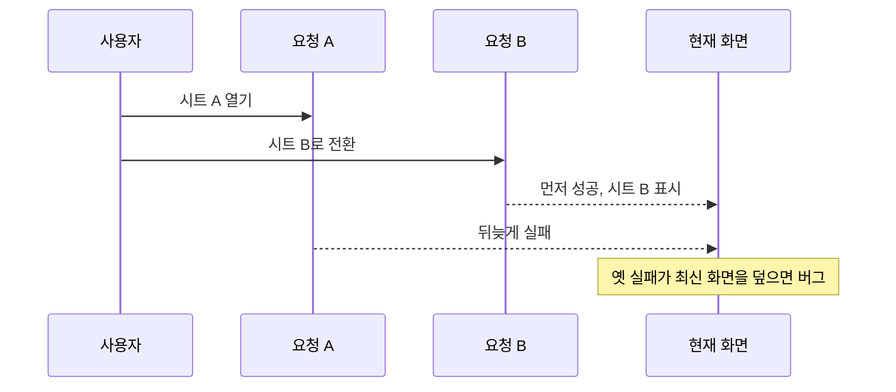

---
tags:
  - frontend
  - react
  - concurrency
  - testing
  - backend
review_answered: false
---

# 오래된 비동기 응답을 막는 요청 세대 가드

> [!summary]
> 비동기 요청은 출발 순서대로 끝난다는 보장이 없다. 화면 상태가 바뀐 뒤 도착한 옛 요청의 성공과 실패를 버려야 최신 화면을 오래된 결과가 덮어쓰는 경쟁 조건을 막을 수 있다.

## 처음 발견한 버그

시트 A를 연 뒤 데이터 요청 A가 출발했다. A가 끝나기 전에 시트 B로 전환하자 요청 B가 새로 출발했고, B는 먼저 성공했다. 그런데 뒤늦게 요청 A가 실패하면서 멀쩡한 시트 B 위에 오류 화면을 덮었다.



이것은 여러 스레드가 같은 메모리를 동시에 수정하는 전통적인 경쟁 조건과 모양은 다르지만, **완료 순서에 따라 최종 상태가 달라진다**는 점에서 비동기 경쟁 조건이다.

---

## 출발 순서와 도착 순서는 다르다

네트워크 지연, 서버 부하, 캐시 적중 여부에 따라 먼저 시작한 요청이 더 늦게 끝날 수 있다.

```text
시간 →

요청 A: 출발 ───────────────── 실패
요청 B:       출발 ─── 성공
```

화면은 이미 B를 기준으로 바뀌었으므로 A의 결과는 더 이상 현재 상태에 적용할 자격이 없다. 성공이더라도 옛 데이터를 덮을 수 있고, 실패라면 현재 화면과 무관한 오류를 표시할 수 있다.

> 늦게 도착했다는 이유만으로 오래된 것은 아니다. **요청을 시작하게 만든 화면 상태가 더 이상 현재 상태가 아닐 때** 그 결과가 오래된 것이다.

## `useEffect` cleanup을 세대 경계로 사용하기

React는 effect의 dependency가 바뀌어 새 effect를 실행하기 전에 이전 effect의 cleanup을 먼저 실행한다.

```tsx
useEffect(() => {
  let cancelled = false

  void loadSheetData()
    .then((data) => {
      if (cancelled) return
      setData(data)
      setDataError(false)
    })
    .catch(() => {
      if (!cancelled) setDataError(true)
    })

  return () => {
    cancelled = true
  }
}, [sheetKind, retryCount])
```

시트가 바뀌면 이전 effect의 `cancelled`가 `true`가 된다. 이후 요청 A가 돌아와도 자신의 세대가 무효화되었음을 확인하고 결과를 버린다.

성공과 실패 양쪽을 모두 막아야 한다.

- 늦은 성공을 허용하면 옛 데이터가 최신 데이터를 덮는다.
- 늦은 실패를 허용하면 정상 화면 위에 잘못된 오류가 뜬다.

## 취소와 결과 무시는 다르다

`cancelled` 플래그는 네트워크 요청 자체를 멈추지 않는다. 요청은 서버에서 계속 실행될 수 있지만, 돌아온 결과를 화면 상태에 반영하지 않는다.

`AbortController`를 지원하는 요청이라면 전송과 응답 처리를 중단할 수도 있다.

| 방식 | 하는 일 | 한계 |
| --- | --- | --- |
| 세대·취소 플래그 | 옛 결과가 상태를 바꾸지 못하게 함 | 서버 작업 자체는 계속될 수 있음 |
| `AbortController` | 가능한 경우 요청을 취소함 | 모든 라이브러리와 서버 작업이 완전히 취소되는 것은 아님 |
| 요청 번호 비교 | 현재 번호와 일치하는 결과만 반영 | 번호 관리가 필요함 |

중요한 불변식은 구현 방식과 관계없이 같다.

> 현재 요청 세대와 일치하지 않는 결과는 화면 상태를 변경할 수 없다.

---

## 경쟁 조건을 운이 아니라 테스트로 만든다

실제 네트워크가 우연히 느려지길 기다리는 테스트는 재현성이 없다. 테스트에서는 직접 완료 시점을 조종할 수 있는 deferred promise를 사용한다.

```ts
function deferred<T>() {
  let resolve!: (value: T) => void
  let reject!: (reason?: unknown) => void
  const promise = new Promise<T>((res, rej) => {
    resolve = res
    reject = rej
  })
  return { promise, resolve, reject }
}
```

테스트가 최악의 순서를 강제로 연출한다.

```text
1. 요청 A 시작 → deferred promise로 대기
2. 화면을 B로 전환
3. 요청 B 즉시 성공 → 정상 화면 확인
4. 이제 요청 A를 실패시킴
5. 오류 UI가 나타나지 않아야 통과
```

이 방식은 “언젠가 운 나쁘면 발생하는 버그”를 “매번 같은 순서로 발생하는 테스트 입력”으로 바꾼다.

## 가드를 일부러 빼고 테스트 실패를 확인한 이유

테스트가 초록색이라고 해서 반드시 버그를 잡는 것은 아니다. 늦은 실패가 처리되기 전에 assertion이 끝났다면 가드가 없어도 통과할 수 있다.

그래서 다음 negative control을 수행했다.

1. `if (!cancelled)` 가드를 일부러 제거한다.
2. 동일한 테스트가 실패하고 오류 UI가 뜨는지 확인한다.
3. 가드를 복원한다.
4. 테스트가 다시 통과하는지 확인한다.

이는 테스트가 단지 현재 코드에서 통과하는 것이 아니라, 보호 코드가 사라졌을 때 실제로 회귀를 감지한다는 증거다. mutation testing의 작은 수동 실험과 비슷하다.

## 백엔드에서도 같은 문제가 생긴다

프론트 화면이 아니어도 다음 상황에서 같은 사고방식이 필요하다.

- 오래된 메시지가 최신 상태를 덮는 이벤트 처리
- 동시에 실행된 배치가 더 최신 결과를 과거 값으로 되돌림
- 낙관적 잠금의 버전이 맞지 않는 UPDATE
- 검색어가 바뀌었는데 이전 검색 결과가 늦게 도착함

해결의 공통점은 **결과가 지금 상태에 적용될 자격이 있는지 버전·세대·토큰으로 확인하는 것**이다.

## 복습 질문

- [ ] 먼저 출발한 요청의 결과가 최신 화면에 적용되면 안 되는 상황은 언제인가?
- [ ] 늦은 실패뿐 아니라 늦은 성공도 차단해야 하는 이유는 무엇인가?
- [ ] `cancelled` 플래그와 `AbortController`는 어떤 차이가 있는가?
- [ ] deferred promise가 경쟁 조건 테스트를 재현 가능하게 만드는 원리는 무엇인가?
- [ ] 가드를 일부러 제거하고 테스트 실패를 확인하는 실험은 무엇을 증명하는가?

## 백지 복습 답변

### 1. 오래된 요청을 판단하는 기준

내 답:

### 2. 성공과 실패 양방향 가드

내 답:

### 3. 결과 무시와 요청 취소

내 답:

### 4. deferred promise

내 답:

### 5. negative control

내 답:

## 한 줄 회고

- 헷갈렸던 점:
