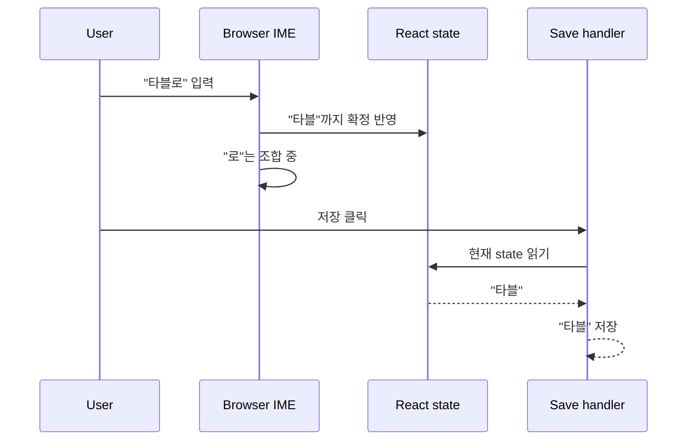

---
tags:
  - react
  - ime
  - controlled-input
  - frontend
  - debugging
---

# React controlled input과 한글 IME 끝글자 잘림

> [!question]
> 내가 물어본 질문:
>
> - React 입력창에서 "타블로"를 입력하고 저장했는데 왜 "타블"만 저장되는가?
> - 영어 입력은 괜찮은데 한글 입력에서만 왜 마지막 글자가 잘리는가?
> - controlled input, IME, state, ref가 이 문제와 어떻게 연결되는가?

> [!summary]
> 결론:
>
> - 한글은 키 입력 즉시 글자가 확정되는 방식이 아니라, 자모를 조합해서 한 글자를 완성하는 IME 입력이다.
> - 마지막 글자가 아직 조합 중인 상태에서 저장 버튼을 누르면 React state나 저장 핸들러가 확정 전 값을 읽을 수 있다.
> - controlled input은 화면의 입력값을 React state로 관리하기 때문에, 브라우저 IME 조합 타이밍과 React state 반영 타이밍이 어긋나면 끝글자 잘림이 생긴다.
> - `blur()`로 조합을 확정시키거나, `compositionend`를 고려하거나, 최신 값을 `ref`에 write-through로 보관하는 식으로 방어한다.
> - 핵심은 저장 시점에 "화면에 보이는 값"이 아니라 "React가 이미 확정해서 들고 있는 값"을 읽는다는 점이다.

## 먼저 잡을 한 줄 정의

> [!info]
> 한글 IME 버그는 사용자가 본 마지막 글자가 아직 브라우저/React 입장에서는 확정된 입력값이 아닐 수 있어서 생기는 타이밍 문제다.

## 왜 한글에서만 터지나

영어는 키 하나를 누르면 대체로 바로 글자가 확정된다.

```text
t 입력 → t 확정
a 입력 → a 확정
b 입력 → b 확정
```

하지만 한글은 자음과 모음을 조합해서 한 글자를 만든다.

```text
ㄹ 입력
ㅗ 입력
→ 로
```

이때 사용자는 화면에서 `로`를 보고 있어도, 브라우저 입장에서는 아직 "조합 중"일 수 있다.

```text
타블 + 로(조합 중)
```

이 상태에서 바로 저장 버튼을 누르면 저장 로직이 읽는 값은 아직 `타블`일 수 있다.

> [!warning]
> 화면에 글자가 보인다는 것과 React state에 확정 반영됐다는 것은 같은 말이 아니다.

## controlled input이란

React controlled input은 입력값을 DOM이 혼자 들고 있게 하지 않고 React state가 관리하게 하는 방식이다.

```jsx
const [name, setName] = useState("");

return (
  <input
    value={name}
    onChange={(e) => setName(e.target.value)}
  />
);
```

흐름은 보통 이렇게 생각한다.

```text
사용자 입력
→ onChange
→ setName(...)
→ React state 변경
→ value={name}으로 화면 다시 그림
```

영어 입력에서는 이 흐름이 직관대로 보인다. 하지만 한글 IME에서는 "입력 중"과 "입력 확정" 사이에 조합 단계가 끼어든다.

## 실제 동작 흐름



사용자 입장에서는 화면에 `타블로`가 보였는데, 저장 로직은 아직 확정된 state인 `타블`을 읽은 것이다.

## blur가 왜 나오는가

저장 전에 입력창에서 포커스를 빼면 브라우저가 조합 중인 글자를 확정하는 경우가 많다.

```js
document.activeElement.blur();
```

의도는 이렇다.

```text
저장 클릭
→ input blur
→ IME 조합 중이던 "로" 확정
→ onChange 발생
→ React state에 "타블로" 반영
→ 저장 로직이 최신 값 읽기
```

그래서 기존 코드에서 `blur()`와 `requestAnimationFrame()` 같은 대기 처리가 같이 나올 수 있다.

```js
document.activeElement.blur();
await new Promise(requestAnimationFrame);
```

> [!warning]
> `blur()`는 "마법처럼 state를 고치는 함수"가 아니다.
> IME 조합을 끝내도록 유도해서 `onChange`가 일어나게 만드는 쪽에 가깝다.

## 그래도 왜 ref가 필요했나

React 18에서는 state 변경이 즉시 render로 반영되지 않고 batching될 수 있다.

```text
setName("타블로")
→ 바로 name 변수가 "타블로"로 바뀌는 것이 아님
→ React가 나중에 render를 다시 실행
```

그래서 저장 로직이 state만 믿으면 타이밍에 따라 예전 값을 읽을 수 있다.

이때 `ref`를 최신 값 박스로 쓸 수 있다.

```jsx
const nameRef = useRef("");

function setNameSync(v) {
  nameRef.current = v;
  setName(v);
}
```

이 방식은 값을 쓸 때 state와 ref를 같이 갱신한다.

```text
입력값 변경
→ ref.current 즉시 갱신
→ state 갱신 예약
```

저장할 때는 render가 끝났는지 기다리지 않고 ref에서 최신 값을 읽는다.

```js
const finalName = nameRef.current;
```

> [!info]
> 이것은 백엔드로 치면 write-through 캐시와 비슷하다.
> DB(state)에 쓰는 순간 캐시(ref)도 같이 갱신해서, 읽을 때 캐시가 오래된 값이 아니게 만드는 방식이다.

## 비교해서 이해하기

| 헷갈린 것 | 실제 의미 | 기억할 점 |
| --- | --- | --- |
| 화면에 보이는 값 | 브라우저가 조합 중인 값까지 보여줄 수 있음 | React state 확정값과 다를 수 있음 |
| `onChange` | 입력값이 React 쪽으로 전달되는 통로 | IME 조합 중에는 기대와 다르게 늦을 수 있음 |
| controlled input | React state가 input 값을 관리 | state 타이밍이 곧 저장값 타이밍이 됨 |
| `blur()` | 포커스를 빼서 조합 확정을 유도 | 단독 해결책이라기보다 보조 방어 |
| `ref` | render와 무관하게 유지되는 가변 박스 | 최신 값을 즉시 보관하는 용도로 사용 가능 |
| setter wrapper | state와 ref를 함께 갱신하는 함수 | raw setter 우회가 있으면 다시 stale 가능 |

## 예시로 이해하기

> [!example]
> "타블로" 저장 버그를 값 흐름으로 보면 다음과 같다.
>
> ```text
> 화면: 타블로
> React state: 타블
> 저장 핸들러가 읽은 값: 타블
> 결과: 마지막 "로"가 빠짐
> ```

고친 흐름은 다음에 가깝다.

```text
입력/확정 이벤트
→ setNameSync("타블로")
→ nameRef.current = "타블로"
→ setName("타블로")
→ 저장 시 nameRef.current 읽기
→ "타블로" 저장
```

## 주의할 점

> [!warning]
> setter wrapper를 만들었다면 모든 쓰기 경로가 그 wrapper를 거쳐야 한다.
>
> ```js
> setName(v);      // 직접 호출하면 ref가 안 바뀔 수 있음
> setNameSync(v);  // ref와 state를 같이 갱신
> ```

입력창 `onChange`만 고치면 끝이 아닐 수 있다. 폼 초기화, 자동 채움, 선택값 변경, 뒤로가기, 모달 재오픈 같은 경로에서도 값을 바꾼다면 모두 같은 wrapper를 써야 한다.

한 곳이라도 raw setter를 직접 부르면 state는 바뀌었는데 ref는 옛날 값으로 남을 수 있다.

## 면접에서 말하면

> [!tip]
> React controlled input에서 한글 끝글자가 잘리는 문제는 IME 조합 타이밍과 React state 반영 타이밍이 어긋나서 생길 수 있습니다. 한글은 자모를 조합한 뒤 확정되기 때문에, 사용자가 화면에서 마지막 글자를 봤더라도 React state에는 아직 반영되지 않았을 수 있습니다. 저장 전에 blur로 조합 확정을 유도하거나 composition 이벤트를 고려하고, 저장 로직이 읽는 최신 값을 `ref`에 write-through 방식으로 관리하면 batching이나 stale closure 영향을 줄일 수 있습니다.

## 내가 다시 헷갈릴 것 같은 부분

- 화면에 보이는 값과 React state 값은 IME 조합 중에 다를 수 있다.
- `setState`를 호출했다고 현재 render의 변수 값이 즉시 바뀌는 것은 아니다.
- `blur()`는 IME 조합 확정을 유도하는 보조 장치다.
- `ref`는 render와 무관하게 살아남는 가변 박스라서 최신값 보관에 쓸 수 있다.
- wrapper를 만들었다면 모든 값 쓰기 경로가 wrapper를 지나야 한다.

## 복습 질문

- [ ] 한글 IME 입력은 영어 입력과 어떤 점이 다른가?
- [ ] 화면에는 `타블로`가 보이는데 저장값이 `타블`이 될 수 있는 이유는 무엇인가?
- [ ] controlled input에서 `value`와 `onChange`는 각각 어떤 역할을 하는가?
- [ ] `blur()`가 한글 끝글자 잘림 문제에서 어떤 역할을 하는가?
- [ ] `ref`와 setter wrapper를 쓰면 왜 저장 시점의 stale 값을 줄일 수 있는가?

## 한 줄 회고

- 헷갈렸던 점: 사용자가 화면에서 본 글자와 React 저장 로직이 읽는 state/ref 값은 IME 조합 타이밍 때문에 서로 다를 수 있다는 점.
