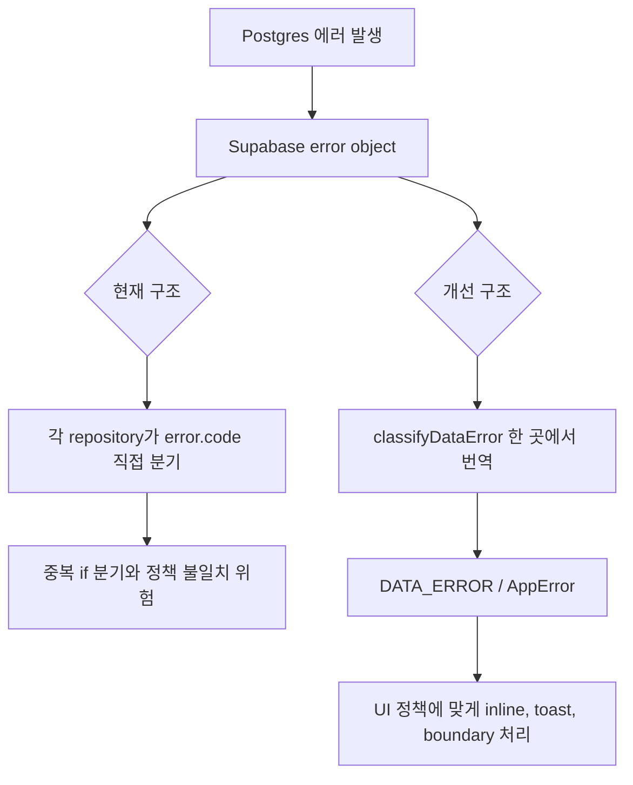
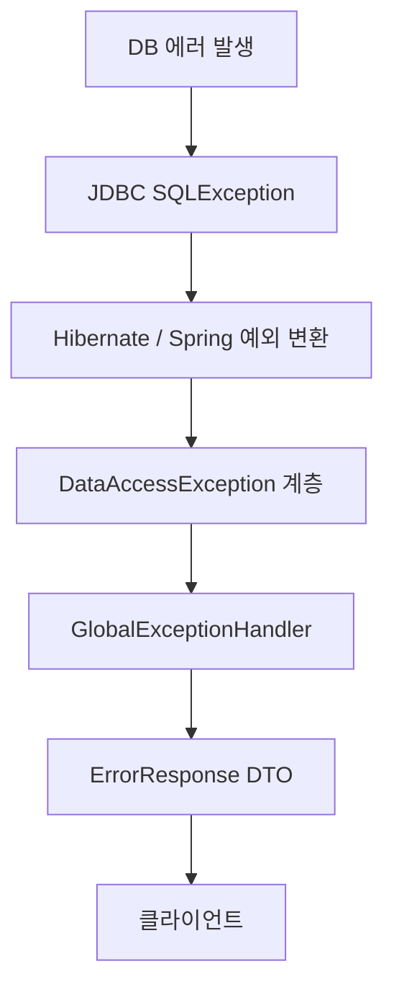

---
tags:
  - backend
  - spring
  - jpa
  - error-handling
  - supabase
  - postgres
---

# DB 에러코드 직접 분기와 Spring/JPA의 예외 추상화

> [!summary]
> 한 줄 요약:
>
> - Spring/JPA에서는 MySQL이나 PostgreSQL의 저수준 DB 에러코드를 애플리케이션 코드가 직접 보지 않도록, 중간에서 의미 있는 예외로 번역해준다.
> - 반대로 React + Supabase 직접 호출 구조에서는 이 번역 계층이 없기 때문에, 프론트 repository 코드가 `23505`, `42501` 같은 PostgreSQL 에러코드를 직접 분기하게 된다.
> - 그래서 지금 프로젝트에서 `classifyDataError`를 만들자는 말은 Spring으로 치면 `SQLExceptionTranslator`와 `DataAccessException` 계층을 얇게 직접 만드는 것에 가깝다.

## 왜 공부했나

> [!question]
> 처음 헷갈렸던 질문:
>
> - React + Supabase 프로젝트에서 왜 repository 코드가 `error.code === "23505"` 같은 분기를 직접 하고 있을까?
> - Spring/JPA를 쓸 때는 MySQL 에러코드를 하나도 몰랐는데, 원래는 `SQLException`에서 `e.getSQLState()`나 `e.getErrorCode()`로 볼 수 있는 것이었나?
> - 이걸 Spring 코드로 치면 어떤 안티패턴에 가까운가?

이번에 본 문제의 출발점은 React + Supabase 프로젝트에서 PostgreSQL 에러코드를 여러 repository 파일이 직접 분기하고 있다는 점이었다.

예를 들어 이런 코드가 여러 곳에 반복되는 상태다.

```ts
if (error.code === "23505") {
  // 중복
}

if (error.code === "42501") {
  // 권한 없음
}
```

처음에는 TypeScript나 Node를 안 해봐서 낯선 문제처럼 느껴졌지만, 백엔드 관점으로 번역하면 훨씬 익숙한 문제다.

> Spring/JPA에서는 프레임워크가 숨겨주던 DB 저수준 디테일이, Supabase 직접 호출 구조에서는 프론트 코드에 그대로 노출된 것이다.

## 핵심 개념

> [!info]
> 개념 정의:
>
> - DB 벤더 에러코드는 MySQL, PostgreSQL 같은 데이터베이스가 제약조건 위반, 권한 없음, 잘못된 값 같은 실패를 표현하기 위해 내려주는 저수준 코드다.
> - Spring은 이런 저수준 `SQLException`을 `DataAccessException` 계층의 의미 있는 예외로 번역한다.
> - 애플리케이션 코드는 가능하면 `23505`, `1062` 같은 DB 내부 코드를 직접 보지 않고, `DuplicateKeyException`, `DataIntegrityViolationException` 같은 추상화된 예외를 다루는 편이 좋다.

DB 에러는 원래 내부적으로 꽤 구체적인 정보를 가진다.

MySQL이라면 unique key 위반 시 vendor error code로 `1062` 같은 코드가 나올 수 있고, SQLState로는 `23000` 같은 값이 나올 수 있다.

PostgreSQL이라면 unique key 위반은 `23505`, 권한 문제는 `42501` 같은 SQLSTATE 코드로 표현된다.

JDBC 레벨에서는 이런 값을 `SQLException`에서 꺼낼 수 있다.

```java
SQLException e;

e.getErrorCode(); // DB 벤더별 에러코드. 예: MySQL 1062
e.getSQLState();  // SQLSTATE 계열 코드. 예: PostgreSQL 23505, MySQL 23000
```

하지만 Spring/JPA를 사용하면 일반적인 서비스/컨트롤러 코드에서 이 값을 직접 볼 일이 거의 없다.

그 이유는 Spring이 중간에서 이런 변환을 해주기 때문이다.

```text
MySQL unique key 위반
-> JDBC SQLException
-> Hibernate 예외
-> Spring DataAccessException 계열
-> @ControllerAdvice 또는 상위 예외 처리로 전달
```

PostgreSQL도 흐름은 비슷하다.

```text
PostgreSQL error 23505
-> SQLException
-> Spring의 예외 변환
-> DuplicateKeyException 또는 DataIntegrityViolationException 계열
```

그래서 JPA를 쓰던 입장에서 MySQL 에러코드를 하나도 몰랐던 것은 이상한 일이 아니다.

> [!info]
> 백엔드 관점에서 보면:
>
> - Spring/JPA는 DB 벤더별 에러코드를 애플리케이션 계층에서 직접 보지 않게 막아주는 보호막 역할을 한다.
> - Supabase를 프론트에서 직접 호출하면 이 보호막이 없어서 DB 에러코드가 프론트 repository까지 올라온다.
> - 지금 프로젝트에서 느낀 위화감은 "프론트가 DB 에러코드를 알아야 하나?"라는 백엔드식 계층 분리 감각과 연결된다.

## Spring 코드로 치면 나쁜 느낌

React + Supabase 코드에서 이런 분기가 있다고 하자.

```ts
if (error.code === "23505") {
  return { type: "duplicate" };
}

if (error.code === "42501") {
  return { type: "forbidden" };
}
```

이걸 Spring 코드로 억지로 번역하면 컨트롤러나 서비스가 `SQLException`을 직접 잡아서 SQLState를 분기하는 모양에 가깝다.

```java
@PostMapping("/users")
public ResponseEntity<?> createUser(@RequestBody CreateUserRequest request) {
    try {
        userService.createUser(request);
        return ResponseEntity.ok().build();

    } catch (SQLException e) {
        if ("23505".equals(e.getSQLState())) {
            return ResponseEntity.status(409)
                    .body("이미 존재하는 사용자입니다");
        }

        if ("42501".equals(e.getSQLState())) {
            return ResponseEntity.status(403)
                    .body("권한이 없습니다");
        }

        throw new RuntimeException(e);
    }
}
```

이 코드는 Spring답지 않다.

이유는 컨트롤러가 너무 많은 것을 알고 있기 때문이다.

- 요청을 받는 컨트롤러가 DB 벤더 에러코드를 안다.
- PostgreSQL의 `23505`가 unique violation이라는 사실을 안다.
- `42501`이 권한 문제라는 사실도 안다.
- 응답 상태 코드와 메시지까지 직접 만든다.
- 같은 분기가 다른 컨트롤러나 서비스에도 복붙될 가능성이 높다.

즉, 원래는 아래쪽 인프라 계층에 가까운 정보가 위쪽 애플리케이션 계층까지 새어 나온 상태다.

> [!warning]
> 주의할 점:
>
> - `23505`, `42501`, `1062` 같은 코드는 도메인 언어가 아니다.
> - 애플리케이션 코드 여기저기에 이런 코드가 퍼지면, 나중에 DB가 바뀌거나 에러 정책이 바뀔 때 수정 지점이 폭발한다.
> - 더 큰 문제는 같은 실패를 어떤 곳은 400, 어떤 곳은 409, 어떤 곳은 빈 배열로 처리하는 식으로 의미가 흐려질 수 있다는 점이다.

## Spring다운 구조

Spring에서는 보통 서비스가 DB 에러코드를 직접 보지 않는다.

서비스는 자기 일을 한다.

```java
@Service
public class UserService {

    private final UserRepository userRepository;

    public UserService(UserRepository userRepository) {
        this.userRepository = userRepository;
    }

    public void createUser(CreateUserRequest request) {
        User user = new User(request.email(), request.name());
        userRepository.save(user);
    }
}
```

여기에는 `23505`도 없고, `1062`도 없고, `SQLException`도 없다.

중복 이메일 때문에 unique 제약조건이 터진다면, DB와 JDBC, Hibernate, Spring을 거치면서 예외가 올라온다.

그리고 Spring의 예외 변환 계층이 저수준 에러를 더 의미 있는 예외로 바꿔준다.

```text
DB unique constraint violation
-> SQLException
-> Hibernate ConstraintViolationException
-> Spring DataIntegrityViolationException
```

JDBC Template 같은 경로에서는 상황에 따라 `DuplicateKeyException`처럼 더 구체적인 예외로 잡히기도 한다.

그 다음 응답 변환은 전역 핸들러에서 한다.

```java
@RestControllerAdvice
public class GlobalExceptionHandler {

    @ExceptionHandler(DataIntegrityViolationException.class)
    public ResponseEntity<ErrorResponse> handleDataIntegrity(
            DataIntegrityViolationException e
    ) {
        return ResponseEntity.status(400)
                .body(new ErrorResponse("INVALID_DATA", "데이터 제약조건을 위반했습니다"));
    }
}
```

중복 키를 더 명확히 처리하고 싶다면 이렇게 분리할 수도 있다.

```java
@RestControllerAdvice
public class GlobalExceptionHandler {

    @ExceptionHandler(DuplicateKeyException.class)
    public ResponseEntity<ErrorResponse> handleDuplicateKey(
            DuplicateKeyException e
    ) {
        return ResponseEntity.status(409)
                .body(new ErrorResponse("DUPLICATE", "이미 등록된 값입니다"));
    }

    @ExceptionHandler(DataIntegrityViolationException.class)
    public ResponseEntity<ErrorResponse> handleDataIntegrity(
            DataIntegrityViolationException e
    ) {
        return ResponseEntity.status(400)
                .body(new ErrorResponse("INVALID_DATA", "요청 데이터가 올바르지 않습니다"));
    }
}
```

핵심은 컨트롤러나 서비스가 DB 내부 코드를 직접 보지 않는다는 점이다.

```text
나쁜 구조:
Controller/Service가 "23505", "42501", "1062" 같은 DB 코드를 직접 본다.

Spring다운 구조:
DB 코드 -> Spring이 의미 있는 예외로 변환한다.
의미 있는 예외 -> GlobalExceptionHandler가 HTTP 응답으로 변환한다.
```

## Supabase 직접 호출 구조와 비교

이번 프로젝트는 전통적인 백엔드 서버가 모든 요청을 받아 처리하는 구조가 아니라, React 클라이언트가 Supabase를 직접 호출하는 구조다.

그래서 흐름이 이렇게 된다.

```text
React component
-> frontend repository
-> Supabase client
-> Postgres
-> Supabase error object
-> frontend repository가 error.code 직접 확인
```

Spring 백엔드가 있다면 보통 이런 식이다.

```text
React component
-> Spring Controller
-> Spring Service
-> Spring Repository
-> DB
-> Spring 예외 변환
-> @RestControllerAdvice
-> ErrorResponse DTO
-> React는 정리된 응답만 받음
```

차이는 "에러 변환 책임이 어디에 있느냐"다.

Spring 백엔드 구조에서는 서버가 DB 에러를 애플리케이션 의미로 바꾸고, HTTP 응답 DTO까지 확정해서 내려준다.

반면 Supabase 직접 호출 구조에서는 클라이언트가 DB에 가까운 에러를 직접 받기 때문에, 프론트 repository가 그 번역을 떠안는다.

> [!example]
> 백엔드 감각으로 번역하면:
>
> "아니 왜 컨트롤러도 아니고 프론트 repository에서 MySQL 1062나 PostgreSQL 23505 같은 걸 직접 보고 있지?"
>
> 이 반응이 맞다. Spring/JPA에서는 보통 프레임워크가 숨겨주던 저수준 디테일이 여기서는 그대로 노출된 것이다.

## `classifyDataError`가 하려는 일

프로젝트에는 이미 auth 쪽 에러 처리 구조가 있다.

```text
classifyAuthError
AUTH_ERROR
AppError
```

이 구조는 인증 에러를 한 곳에서 의미 있는 애플리케이션 에러로 바꾸는 역할을 한다.

하지만 data 쪽에는 아직 비슷한 계층이 없어서, 여러 repository가 직접 PostgreSQL 에러코드를 분기한다.

그래서 `classifyDataError`와 `DATA_ERROR`를 만들자는 말은 Spring으로 치면 이런 뜻에 가깝다.

> [!summary]
> `classifyDataError`는 Supabase/PostgreSQL의 저수준 에러코드를 `DUPLICATE`, `FORBIDDEN`, `NOT_FOUND`, `INVALID_INPUT` 같은 애플리케이션 의미로 번역하는 수동 `SQLExceptionTranslator`다.

예상되는 흐름은 이렇다.

```text
Supabase error.code = "23505"
-> classifyDataError(error)
-> DATA_ERROR.DUPLICATE
-> AppError
-> UI에서는 중복 에러로 표시
```

```text
Supabase error.code = "42501"
-> classifyDataError(error)
-> DATA_ERROR.FORBIDDEN
-> AppError
-> UI에서는 권한 없음으로 표시
```

이렇게 하면 repository마다 직접 `if (error.code === "...")`를 반복하지 않아도 된다.

중요한 것은 에러코드 자체를 없애는 것이 아니라, 에러코드를 아는 위치를 한 곳으로 모으는 것이다.

## `return []`로 실패를 숨기는 문제

이번 내용과 연결되는 또 다른 중요한 원칙은 "실패와 빈 결과를 구분해야 한다"는 점이다.

예를 들어 데이터를 읽다가 DB 에러가 났는데 repository가 그냥 빈 배열을 반환한다고 하자.

```ts
if (error) {
  return [];
}
```

겉으로는 UI가 깨지지 않으니 좋아 보일 수 있다.

하지만 이러면 두 상황이 구분되지 않는다.

- 진짜 데이터가 하나도 없음
- 데이터를 읽는 데 실패했는데 빈 것처럼 보임

Spring으로 치면 이런 느낌이다.

```java
public List<User> findUsers() {
    try {
        return userRepository.findAll();
    } catch (DataAccessException e) {
        return List.of();
    }
}
```

이 코드는 위험하다.

DB 장애, 권한 문제, SQL 오류 같은 실패를 정상 빈 결과처럼 바꿔버리기 때문이다.

> [!danger]
> 위험한 오해:
>
> - UI를 안 깨뜨리려고 실패를 빈 배열로 바꾸면 안정적인 코드처럼 보일 수 있다.
> - 하지만 실제로는 장애를 정상 상태로 위장하는 코드가 된다.
> - "없음"은 정상 결과이고, "읽기 실패"는 예외나 에러 상태다. 둘은 반드시 구분해야 한다.

Spring식으로 말하면 이런 원칙이다.

```text
정상 빈 결과:
Repository 조회 성공, 결과가 0개

실패:
DB 연결 실패, 권한 없음, 제약조건 위반, 잘못된 인자, 예상 못한 예외
```

정상 빈 결과는 빈 리스트나 `Optional.empty()`로 표현할 수 있다.

하지만 실패는 실패로 전파하고, 전역 핸들러나 UI 정책에서 다뤄야 한다.

## 전체 동작 흐름



Spring/JPA 구조로 보면 이렇게 대응된다.



## 실무에서 보는 포인트

| 관점 | 확인할 것 | 왜 중요한가 |
| --- | --- | --- |
| 애플리케이션 | DB 에러코드를 어느 계층이 알고 있는가 | 저수준 인프라 정보가 서비스나 UI까지 새면 변경에 약해진다 |
| 에러 정책 | 같은 실패가 항상 같은 의미로 처리되는가 | 어떤 화면은 409, 어떤 화면은 빈 배열처럼 처리하면 장애 분석이 어려워진다 |
| 프론트 | 실패와 빈 상태를 구분하는가 | 사용자에게 "데이터 없음"과 "불러오기 실패"는 완전히 다른 상태다 |
| 백엔드 | `@ControllerAdvice`에서 공통 응답을 만드는가 | API 에러 응답 형식이 통일되어야 프론트도 안정적으로 처리할 수 있다 |
| 마이그레이션 | 코프링으로 가면 어떤 책임이 서버로 이동하는가 | Supabase 직접 호출에서 손으로 만들던 에러 변환 계층이 Spring 표준 구조로 흡수될 수 있다 |
| 면접 | 벤더 에러코드와 애플리케이션 예외를 구분해서 설명할 수 있는가 | "예외 추상화"와 "계층 분리"를 실무적으로 이해하고 있음을 보여준다 |

## 헷갈리기 쉬운 부분

> [!warning]
> `SQLException`을 무조건 직접 잡으면 안 된다는 뜻은 아니다.
>
> - 아주 낮은 레벨의 인프라 코드를 직접 작성한다면 볼 수도 있다.
> - 하지만 일반적인 Spring MVC + Service + Repository 구조에서는 컨트롤러나 서비스가 DB 벤더 코드를 직접 분기하는 경우가 드물다.
> - 대부분은 Spring의 예외 변환 계층과 전역 예외 핸들러에 맡기는 편이 자연스럽다.

> [!warning]
> JPA와 JDBC Template은 예외가 조금 다르게 보일 수 있다.
>
> - JPA/Hibernate에서는 `DataIntegrityViolationException`처럼 조금 넓은 예외로 잡히는 경우가 많다.
> - JDBC Template 경로에서는 `DuplicateKeyException`처럼 더 구체적인 Spring 예외가 보일 수 있다.
> - 중요한 것은 정확히 어떤 클래스냐보다, DB 벤더 에러를 애플리케이션 계층에서 직접 분기하지 않도록 추상화한다는 점이다.

> [!warning]
> React ErrorBoundary와 Spring `@ControllerAdvice`는 완전히 같은 것은 아니다.
>
> - Spring `@ControllerAdvice`는 서버에서 예외를 HTTP 응답으로 바꾸는 전역 핸들러다.
> - React ErrorBoundary는 렌더링 중 발생한 오류로 화면 전체가 죽지 않도록 복구하는 프론트 전용 장치다.
> - 백엔드를 Spring으로 바꿔도 React ErrorBoundary는 별도로 필요할 수 있다.

## 면접 답변으로 말하면

> [!tip]
> 짧게 답변:
>
> Spring에서는 DB 벤더별 에러코드를 애플리케이션 코드가 직접 분기하지 않도록 `SQLException`을 `DataAccessException` 계층으로 변환해줍니다. 예를 들어 unique 제약조건 위반 같은 저수준 DB 에러는 `DataIntegrityViolationException`이나 `DuplicateKeyException` 같은 의미 있는 예외로 올라오고, 컨트롤러에서는 보통 이를 직접 처리하지 않고 `@ControllerAdvice`에서 공통 에러 응답으로 변환합니다. 이렇게 하면 DB 에러코드가 서비스나 컨트롤러에 퍼지지 않고, 에러 정책도 한 곳에서 관리할 수 있습니다.

> [!note]-
> 긴 설명
>
> JPA나 Spring Data를 쓰면 MySQL의 `1062`나 PostgreSQL의 `23505` 같은 코드를 직접 볼 일이 거의 없습니다. JDBC 레벨에서는 `SQLException.getErrorCode()`나 `getSQLState()`로 볼 수 있지만, Spring은 이 저수준 예외를 `DataAccessException` 계층으로 번역해줍니다. 그래서 서비스는 저장, 조회 같은 비즈니스 흐름에 집중하고, 예외 응답 변환은 `@ControllerAdvice`에서 공통으로 처리합니다.
>
> 반대로 Supabase를 프론트에서 직접 호출하는 구조에서는 Spring 백엔드가 해주던 예외 변환 계층이 없습니다. 그래서 Supabase가 내려준 PostgreSQL 에러코드를 프론트 repository가 직접 보게 됩니다. 이때 여러 repository가 `error.code === "23505"` 같은 분기를 복붙하면 Spring에서 컨트롤러마다 `SQLException`의 SQLState를 직접 보는 것과 비슷한 안티패턴이 됩니다.
>
> 따라서 `classifyDataError` 같은 함수를 만들어 Supabase/PostgreSQL 에러코드를 한 곳에서 애플리케이션 의미의 에러로 바꾸는 것이 좋습니다. 이것은 Spring의 `SQLExceptionTranslator`와 `DataAccessException` 계층을 프로젝트 안에서 얇게 흉내 내는 것에 가깝습니다.

## 오늘 깨달은 점

JPA를 써왔기 때문에 MySQL 에러코드를 몰랐던 것은 당연한 편이다.

JPA/Spring이 중간에서 DB 저수준 예외를 추상화해줬기 때문에, 일반적인 백엔드 코드에서는 MySQL `1062`나 PostgreSQL `23505` 같은 값을 직접 다룰 일이 없었다.

그래서 이번 React + Supabase 코드에서 PostgreSQL 에러코드를 프론트 repository가 직접 보고 있는 것이 낯설게 느껴진 것이다.

이 낯섦은 단순히 TypeScript나 Node를 몰라서 생긴 문제가 아니다.

오히려 Spring/JPA가 제공하던 계층 분리와 예외 추상화에 익숙했기 때문에 생긴 정상적인 위화감이다.

> 프론트 repository가 PostgreSQL 에러코드를 직접 본다는 것은, 백엔드로 치면 컨트롤러나 서비스가 MySQL vendor code를 직접 분기하는 느낌이다.

## 나중에 다시 볼 포인트

- `SQLException.getErrorCode()`는 DB 벤더별 코드다. MySQL `1062` 같은 값이 여기에 해당한다.
- `SQLException.getSQLState()`는 SQLSTATE 계열 코드다. PostgreSQL `23505`, `42501` 같은 값이 여기에 해당한다.
- Spring은 `SQLExceptionTranslator`를 통해 저수준 DB 예외를 `DataAccessException` 계층으로 바꾼다.
- JPA/Hibernate를 거치면 예외가 Hibernate 예외를 통과한 뒤 Spring 예외로 변환될 수 있다.
- `classifyDataError`는 Supabase 직접 호출 구조에서 이 번역 계층을 수동으로 만드는 작업이다.
- 실패를 빈 배열로 바꾸는 코드는 장애를 정상 빈 상태로 위장할 수 있다.
- "진짜 없음"과 "읽기 실패"는 반드시 분리해야 한다.

## 복습 질문

- [ ] Spring/JPA를 쓰면 왜 MySQL이나 PostgreSQL의 에러코드를 직접 볼 일이 적은가?
- [ ] `SQLException.getErrorCode()`와 `SQLException.getSQLState()`는 각각 어떤 값을 의미하는가?
- [ ] React + Supabase에서 `error.code === "23505"`를 여러 repository가 직접 분기하는 것은 Spring 코드로 치면 어떤 느낌인가?
- [ ] `classifyDataError`는 Spring의 어떤 계층과 비슷한 역할을 하는가?
- [ ] 데이터 조회 실패를 `return []`로 처리하면 왜 위험한가?

## 한 줄 회고

- 헷갈렸던 점: TypeScript나 Node를 몰라서 낯선 문제가 아니라, Spring/JPA가 숨겨주던 DB 저수준 에러코드가 Supabase 직접 호출 구조에서는 프론트까지 그대로 올라온다는 점이 핵심이었다.
