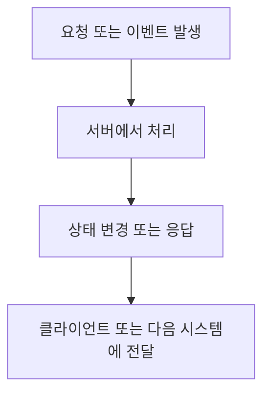

# {{title}}

> [!summary]
> 한 줄 요약:
> 
> - 

## 왜 공부했나

> [!question]
> 처음 헷갈렸던 질문:
> 
> - 

## 핵심 개념

> [!info]
> 개념 정의:
> 
> - 

> [!info]
> 백엔드 관점에서 보면:
> 
> - 

## 동작 흐름



## 실무에서 보는 포인트

| 관점 | 확인할 것 | 왜 중요한가 |
| --- | --- | --- |
| 애플리케이션 |  |  |
| 인프라 |  |  |
| 장애 대응 |  |  |
| 면접 |  |  |

## 헷갈리기 쉬운 부분

> [!warning]
> 주의할 점:
> 
> - 

> [!danger]
> 위험한 오해:
> 
> - 

## 예시

> [!example]
> 예시 상황:
> 
> ```text
> 
> ```

## 면접 답변으로 말하면

> [!tip]
> 짧게 답변:
> 
> 

> [!note]-
> 긴 설명
> 
> 

## 관련 명령어 또는 키워드

```bash

```

## 나중에 다시 볼 포인트

- 

## 복습 체크리스트

- [ ] 한 줄로 설명할 수 있다.
- [ ] 왜 쓰는지 설명할 수 있다.
- [ ] 무엇과 다른지 비교할 수 있다.
- [ ] 실무에서 어떤 문제가 생기는지 말할 수 있다.
- [ ] 면접 답변으로 30초 안에 말할 수 있다.

