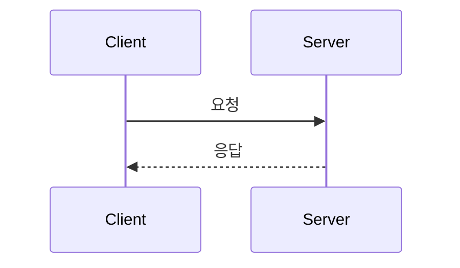

# {{question}}

> [!question]
> 내가 물어본 질문:
> 
> - 

> [!summary]
> 결론:
> 
> - 

## 먼저 잡을 한 줄 정의

> [!info]
> 

## 왜 헷갈렸나

- 

## 실제 동작 흐름



## 비교해서 이해하기

| 헷갈린 것 | 실제 의미 | 기억할 점 |
| --- | --- | --- |
|  |  |  |

## 예시로 이해하기

> [!example]
> 
> ```text
> 
> ```

## 주의할 점

> [!warning]
> 
> - 

## 면접에서 말하면

> [!tip]
> 
> 

> [!note]-
> 더 긴 설명
> 
> 

## 내가 다시 헷갈릴 것 같은 부분

- 

## 복습 체크리스트

- [ ] 질문의 핵심을 다시 말할 수 있다.
- [ ] 한 줄 정의를 말할 수 있다.
- [ ] 예시 없이도 흐름을 설명할 수 있다.
- [ ] 비슷한 개념과 차이를 설명할 수 있다.
- [ ] 면접 답변으로 짧게 정리할 수 있다.

